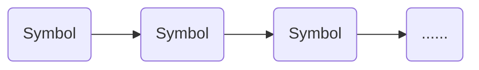
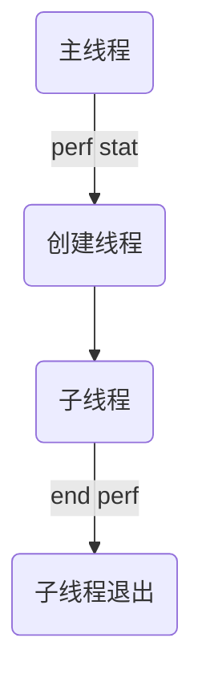

Details
============
### Counting
libkperf提供Counting模式，类似于perf stat功能。
例如，如下perf命令:
```
perf stat -e cycles,branch-misses
```
该命令是对系统采集cycles和branch-misses这两个事件的计数。

对于libkperf，可以这样来设置PmuAttr：
```c++
char *evtList[2];
evtList[0] = "cycles";
evtList[1] = "branch-misses";
PmuAttr attr = {0};
attr.evtList = evtList;
attr.numEvt = 2;
int pd = PmuOpen(COUNTING, &attr);
```
通过调用```PmuOpen```初始化了采集任务，并获得了任务的标识符pd。
然后，可以利用pd来启动采集：
```c++
PmuEnable(pd);
sleep(any_duration);
PmuDisable(pd);
```
不论是否停止了采集，都可以通过```PmuRead```来读取采集数据：
```c++
PmuData *data = NULL;
int len = PmuRead(pd, &data);
```
```PmuRead```会返回采集数据的长度。
如果是对系统采集，那么PmuData的长度等于core的数量乘以事件的数量，PmuData的数据类似如下：
```
cpu 0 count 123     evt cycles
cpu 1 count 1242354 evt cycles
cpu 2 count 7897234 evt cycles
...
cpu 0 count 423423  evt branch-misses
cpu 1 count 124235  evt branch-misses
cpu 2 count 789723  evt branch-misses
...
```
如果是对进程采集，那么PmuData的长度等于进程内线程的数量乘以事件的数量，PmuData的数据类似如下：
```
pid 4156 tid 4156 count 123     evt cycles
pid 4156 tid 4157 count 534123  evt cycles
pid 4156 tid 4158 count 1241244 evt cycles
...
pid 4156 tid 4156 count 12414 evt branch-misses
pid 4156 tid 4157 count 5123  evt branch-misses
pid 4156 tid 4158 count 64574 evt branch-misses
...
```

### Sampling
libkperf提供Sampling模式，类似于perf record的如下命令：
```
perf record -e cycles,branch-misses
```
该命令是对系统采样cycles和branch-misses这两个事件。

设置PmuAttr的方式和Counting一样，在调用PmuOpen的时候，把任务类型设置为SAMPLING，并且设置采样频率：
```c++
// 采样频率是1000HZ
attr.freq = 1000;
attr.useFreq = 1;
int pd = PmuOpen(SAMPLING, &attr);
```

启动采集和读取数据的方式和Counting一致。
如果是对系统采集，PmuData的数据类似如下（长度取决于数据量）：
```
cpu 0 pid 3145 tid 3145 period 12314352
cpu 0 pid 4145 tid 4145 period 12314367
...
cpu 1 pid 23423 tid 23423 period 1231241
...
...
```
如果是对进程采集，PmuData的数据类似如下：
```
cpu 32 pid 7878 tid 7878 period 123144
cpu 32 pid 7878 tid 7879 period 1523342
cpu 32 pid 7878 tid 7879 period 1234342
...
```
每一条记录还包含触发事件的程序地址和符号信息，关于如何获取符号信息，可以参考[获取符号信息](#获取符号信息)这一章节。

### SPE Sampling
libkperf提供SPE采样模式，类似于perf record的如下命令：
```
perf record -e arm_spe_0/load_filter=1/
```
该命令是对系统进行spe采样，关于linux spe采样的详细介绍，可以参考[这里](https://www.man7.org/linux/man-pages/man1/perf-arm-spe.1.html)。

对于libkperf，可以这样设置PmuAttr：
```c++
PmuAttr attr = {0};
// 采样周期是8192
attr.period = 8192;
// 设置filter属性为load_filter
attr.dataFilter = LOAD_FILTER;
```
对于spe采样，不需要设置evtList，而是通过设置dataFilter和evFilter来指定需要采集的事件。dataFilter和evFilter的含义仍然可以参考[perf spe的说明文档](https://www.man7.org/linux/man-pages/man1/perf-arm-spe.1.html)。

采样数据PmuData和Sampling模式差不多，差别是：
- SPE采样的调用栈只有一层，而Sampling可以有多层调用栈。
- SPE的PmuData提供了额外的数据struct PmuDataExt *ext.
PmuDataExt包含spe特有的数据：访存的物理地址、虚拟地址和事件bit。
```c++
struct PmuDataExt {
    unsigned long pa;               // physical address
    unsigned long va;               // virtual address
    unsigned long event;            // event id, which is a bit map of mixed events, event bit is defined in SPE_EVENTS.
};
```
其中，物理地址pa需要在启用PA_ENABLE的情况下才能采集。
event是一个bit map，是多个事件的集合，每一个事件占据一个bit，事件对应的bit参考枚举SPE_EVENTS：
```c++
enum SPE_EVENTS {
    SPE_EV_EXCEPT       = 1 << 0,
    SPE_EV_RETIRED      = 1 << 1,
    SPE_EV_L1D_ACCESS   = 1 << 2,
    SPE_EV_L1D_REFILL   = 1 << 3,
    SPE_EV_TLB_ACCESS   = 1 << 4,
    SPE_EV_TLB_WALK     = 1 << 5,
    SPE_EV_NOT_TAKEN    = 1 << 6,
    SPE_EV_MISPRED      = 1 << 7,
    SPE_EV_LLC_ACCESS   = 1 << 8,
    SPE_EV_LLC_MISS     = 1 << 9,
    SPE_EV_REMOTE_ACCESS= 1 << 10,
    SPE_EV_ALIGNMENT    = 1 << 11,
    SPE_EV_PARTIAL_PRED = 1 << 17,
    SPE_EV_EMPTY_PRED   = 1 << 18,
};
```

### 获取符号信息
结构体PmuData里提供了采样数据的调用栈信息，包含调用栈的地址、符号名称等。
```c++
struct Symbol {
    unsigned long addr;
    char* module;
    char* symbolName;
    char* fileName;
    unsigned int lineNum;
    ...
};

struct Stack {
    struct Symbol* symbol;
    struct Stack* next;
    struct Stack* prev;
    ...
} __attribute__((aligned(64)));
```

Stack是链表结构，每一个元素都是一层调用函数。


Symbol的字段信息受PmuAttr影响：
- PmuAttr.callStack会决定Stack是完整的调用栈，还是只有一层调用栈（即Stack链表只有一个元素）。
- PmuAttr.symbolMode如果等于NO_SYMBOL_RESOLVE，那么PmuData的stack是空指针。
- PmuAttr.symbolMode如果等于RESOLVE_ELF，那么Symbol的fileName和lineNum没有数据，都等于0，因为没有解析dwarf信息。
- PmuAttr.symbolMode如果等于RESOLVE_ELF_DWARF，那么Symbol的所有信息都有效。

### 采集uncore事件
libkperf支持uncore事件的采集，只有Counting模式支持uncore事件的采集（和perf一致）。
可以像这样设置PmuAttr：
```c++
char *evtList[1];
evtList[0] = "hisi_sccl1_ddrc0/flux_rd/";
PmuAttr attr = {0};
attr.evtList = evtList;
attr.numEvt = 1;
int pd = PmuOpen(COUNTING, &attr);
```
uncore事件的格式为```<device>/<event>/```，上面代码是采集设备hisi_sccl1_ddrc0的flux_rd事件。

也可以把设备索引号省略：
```c++
evtList[0] = "hisi_sccl1_ddrc/flux_rd/";
```
这里把hisi_sccl1_ddrc0改为了hisi_sccl1_ddrc，这样会采集设备hisi_sccl1_ddrc0、hisi_sccl1_ddrc1、hisi_sccl1_ddrc2...，并且采集数据PmuData是所有设备数据的总和：count = count(hisi_sccl1_ddrc0) + count(hisi_sccl1_ddrc1) + count(hisi_sccl1_ddrc2) + ...

也可以通过```<device>/config=0xxx/```的方式来指定事件名：
```c++
evtList[0] = "hisi_sccl1_ddrc0/config=0x1/";
```
这样效果是和指定flux_rd是一样的。

### 采集tracepoint
libkperf支持tracepoint的采集，支持的tracepoint事件可以通过perf list来查看（通常需要root权限）。
可以这样设置PmuAttr：
```c++
char *evtList[1];
evtList[0] = "sched:sched_switch";
PmuAttr attr = {0};
attr.evtList = evtList;
attr.numEvt = 1;
```

tracepoint支持Counting和Sampling两种模式，API调用流程和两者相似。
tracepoint能够获取每个事件特有的数据，比如sched:sched_switch包含的数据有：prev_comm, prev_pid, prev_prio, prev_state, next_comm, next_pid, next_prio.
想要查询每个事件包含哪些数据，可以查看/sys/kernel/tracing/events下面的文件内容，比如/sys/kernel/tracing/events/sched/sched_switch/format。

libkperf提供了接口PmuGetField来获取tracepoint的数据。比如对于sched:sched_switch，可以这样调用：
```c++
int prev_pid;
PmuGetField(pmuData->rawData, "prev_pid", &prev_pid, sizeof(prev_pid));
char next_comm[16];
PmuGetField(pmuData->rawData, "next_comm", &next_comm, sizeof(next_comm));
```
这里调用者需要提前了解数据的类型，并且指定数据的大小。数据的类型和大小仍然可以从/sys/kernel/tracing/下每个事件的format文件来得知。

### 事件分组
libkperf提供了事件分组的能力，能够让多个事件同时处于采集状态。
该功能类似于perf的如下使用方式：
```
perf stat -e "{cycles,branch-loads,branch-load-misses,iTLB-loads}",inst_retired
```

对于libkperf，可以通过设置PmuAttr的evtAttr字段来设定哪些事件放在一个group内。
比如，可以这样调用：
```c
unsigned numEvt = 5;
char *evtList[numEvt] = {"cycles","branch-loads","branch-load-misses","iTLB-loads","inst_retired"};
// 前四个事件是一个分组
struct EvtAttr groupId[numEvt] = {1,1,1,1,-1};
PmuAttr attr = {0};
attr.evtList = evtList;
attr.numEvt = numEvt;
attr.evtAttr = groupId;
```
上述代码把前四个事件设定为一个分组，groupId都设定为1，最后一个事件不分组，groupId设定为-1。
事件数组attr.evtList和事件属性数组attr.evtAttr必须一一对应，即长度必须一致。
或者attr.evtAttr也可以是空指针，那么所有事件都不分组。

事件分组的效果可以从PmuData.countPercent来体现。PmuData.countPercent表示事件实际采集时间除以事件期望采集时间。
对于同一组的事件，他们的countPercent是相同的。如果一个组的事件过多，超过了硬件计数器的数目，那么这个组的所有事件都不会被采集，countPercent会等于-1.

### 对进程子线程计数采集

考虑上面的场景：用perf stat对进程采集，之后进程创建了子线程，采集一段事件后，停止perf。
查看采集结果，perf只会显示主线程的采集结果，而无法看到子线程的结果：count = count(main thread) + count(thread). perf把子线程的数据聚合到了主线程上。

libkperf提供了采集子线程的能力。如果想要在上面场景中获取子线程的计数，可以把PmuAttr.incluceNewFork设置为1.
```c++
attr.includeNewFork = 1;
```
然后，通过PmuRead获取到的PmuData，便能包含子线程计数信息了。
注意，该功能是针对Counting模式，因为Sampling和SPE Sampling本身就会采集子线程的数据。