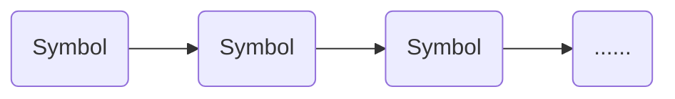
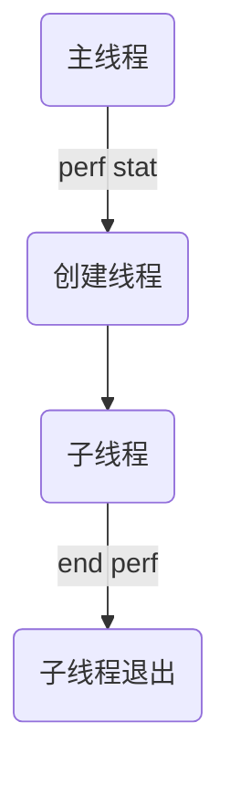

Details
============
### Counting
libkperf提供Counting模式，类似于perf stat功能。
例如，如下perf命令:
```
perf stat -e cycles,branch-misses
```
该命令是对系统采集cycles和branch-misses这两个事件的计数。

对于libkperf，可以这样来设置PmuAttr：

```c++
// c++代码示例
char *evtList[2];
evtList[0] = "cycles";
evtList[1] = "branch-misses";
PmuAttr attr = {0};
attr.evtList = evtList;
attr.numEvt = 2;
int pd = PmuOpen(COUNTING, &attr);
```

```python
# python代码示例
import time
import kperf

evtList = ["cycles", "branch-misses"]
pmu_attr = kperf.PmuAttr(evtList=evtList)
pd = kperf.open(kperf.PmuTaskType.COUNTING, pmu_attr)
if pd == -1:
    print(kperf.error())
    exit(1)
```

```go
import "libkperf/kperf"
import "fmt"

func main() {
    attr := kperf.PmuAttr{EvtList:[]string{"cycles", "branch-misses"}}
    pd, err := kperf.PmuOpen(kperf.COUNT, attr)
	if err != nil {
		fmt.Printf("kperf pmuopen counting failed, expect err is nil, but is %v", err)
        return
	}
}

```

通过调用```PmuOpen```初始化了采集任务，并获得了任务的标识符pd。
然后，可以利用pd来启动采集：
```c++
// c++代码示例
PmuEnable(pd);
sleep(any_duration);
PmuDisable(pd);
```

```python
# python代码示例
kperf.enable(pd)
time.sleep(1)
kperf.disable(pd)
```

```go
kperf.PmuEnable(pd)
time.Sleep(time.Second)
kperf.PmuDisable(pd)
```
不论是否停止了采集，都可以通过```PmuRead```来读取采集数据：
```c++
// c++代码示例
PmuData *data = NULL;
int len = PmuRead(pd, &data);
```
```PmuRead```会返回采集数据的长度。
                                              
```python
# python代码示例
pmu_data = kperf.read(pd)
for data in pmu_data.iter:
    print(f"cpu {data.cpu} count {data.count} evt {data.evt}")
```
```kperf.read```会返回采集数据链表,可以通过遍历的方式读取。

```go
// go代码示例
dataVo, err := kperf.PmuRead(fd)
if err != nil {
    fmt.Printf("kperf pmuread failed, expect err is nil, but is %v\n", err)
    return
}

for _, o := range dataVo.GoData {
    fmt.Printf("cpu %v count %v evt %v\n", o.Cpu, o.Count, o.Evt)
}
```

```kperf.PmuRead```会返回数据结构体PmuDataVo, PmuDataVo中有转换成GO数据的结构体列表<GoData>
可以遍历读取

如果是对系统采集，那么PmuData的长度等于core的数量乘以事件的数量，PmuData的数据类似如下：
```
cpu 0 count 123     evt cycles
cpu 1 count 1242354 evt cycles
cpu 2 count 7897234 evt cycles
...
cpu 0 count 423423  evt branch-misses
cpu 1 count 124235  evt branch-misses
cpu 2 count 789723  evt branch-misses
...
```
如果是对进程采集，那么PmuData的长度等于进程内线程的数量乘以事件的数量，PmuData的数据类似如下：
```
pid 4156 tid 4156 count 123     evt cycles
pid 4156 tid 4157 count 534123  evt cycles
pid 4156 tid 4158 count 1241244 evt cycles
...
pid 4156 tid 4156 count 12414 evt branch-misses
pid 4156 tid 4157 count 5123  evt branch-misses
pid 4156 tid 4158 count 64574 evt branch-misses
...
```

### Sampling
libkperf提供Sampling模式，类似于perf record的如下命令：
```
perf record -e cycles,branch-misses
```
该命令是对系统采样cycles和branch-misses这两个事件。

设置PmuAttr的方式和Counting一样，在调用PmuOpen的时候，把任务类型设置为SAMPLING，并且设置采样频率：
```c++
// c++代码示例
#include <iostream>
#include "symbol.h"
#include "pmu.h"
#include "pcerrc.h"

PmuAttr attr = {0};
char* evtList[1] = {"cycles"};
attr.freq = 1000; // 采样频率是1000HZ
attr.useFreq = 1;
attr.evtList = evtList;
attr.numEvt = 1;
int pd = PmuOpen(SAMPLING, &attr);
if ( pd == -1) {
   printf("kperf pmuopen counting failed, expect err is nil, but is %s\n", Perror());
}
PmuEnable(pd);
sleep(1);
PmuDisable(pd);
PmuData* data = nullptr;
int len = PmuRead(pd, &data);
for (int i = 0; i < len; i++) {
    printf("cpu=%d pid=%d tid=%d period=%ld\n", data[i].cpu, data[i].pid, data[i].tid, data[i].period);
}
PmuClose(pd);
```

```python
# python代码示例
import kperf
import ksym
import time

evtList = ["branch-misses", "cycles"]
pmu_attr = kperf.PmuAttr(
        evtList=evtList,
        sampleRate=1000, # 采样频率是1000HZ
        symbolMode=kperf.SymbolMode.RESOLVE_ELF
    )
pd = kperf.open(kperf.PmuTaskType.SAMPLING, pmu_attr)
if pd == -1:
    print(f"kperf pmuopen sample failed, expect err is nil, but is {kperf.error()}\n")
kperf.enable(pd)
time.sleep(1)
kperf.disable(pd)

pmu_data = kperf.read(pd)
for item in pmu_data.iter:
    print(f"cpu {item.cpu} pid {item.pid} tid {item.tid} period {item.period}")
kperf.close(pd)
```

```go
//go代码示例
import "libkperf/kperf"
import "fmt"
import "time"

func main() {
    attr := kperf.PmuAttr{EvtList:[]string{"cycles"}, SymbolMode:kperf.ELF, SampleRate: 1000}
    pd, err := kperf.PmuOpen(kperf.SAMPLE, attr)
	if err != nil {
		fmt.Printf("kperf pmuopen sample failed, expect err is nil, but is %v\n", err)
        return
	}
    kperf.PmuEnable(pd)
    time.Sleep(time.Second)
    kperf.PmuDisable(pd)
    dataVo, err := kperf.PmuRead(pd)
    if err != nil {
        fmt.Printf("kperf pmuread failed, expect err is nil, but is %v\n", err)
        return
    }
    for _, o := range dataVo.GoData {
        fmt.Printf("cpu=%d pid=%d tid=%d period=%v\n", o.Cpu, o.Pid, o.Tid, o.Period)
    }
    kperf.PmuClose(pd)
}
```

启动采集和读取数据的方式和Counting一致。
如果是对系统采集，PmuData的数据类似如下（长度取决于数据量）：
```
cpu 0 pid 3145 tid 3145 period 12314352
cpu 0 pid 4145 tid 4145 period 12314367
...
cpu 1 pid 23423 tid 23423 period 1231241
...
...
```
如果是对进程采集，PmuData的数据类似如下：
```
cpu 32 pid 7878 tid 7878 period 123144
cpu 32 pid 7878 tid 7879 period 1523342
cpu 32 pid 7878 tid 7879 period 1234342
...
```
每一条记录还包含触发事件的程序地址和符号信息，关于如何获取符号信息，可以参考[获取符号信息](#获取符号信息)这一章节。

### SPE Sampling
libkperf提供SPE采样模式，类似于perf record的如下命令：
```
perf record -e arm_spe_0/load_filter=1/
```
该命令是对系统进行spe采样，关于linux spe采样的详细介绍，可以参考[这里](https://www.man7.org/linux/man-pages/man1/perf-arm-spe.1.html)。

对于libkperf，可以这样设置PmuAttr：
```c++
// c++代码示例
#include <iostream>

#include "symbol.h"
#include "pmu.h"
#include "pcerrc.h"

PmuAttr attr = {0};
attr.period = 8192; // 采样周期是8192
attr.dataFilter = LOAD_FILTER; // 设置filter属性为load_filter

int pd = PmuOpen(SPE_SAMPLING, &attr);
if ( pd == -1) {
   printf("kperf pmuopen counting failed, expect err is nil, but is %s\n", Perror());
}
PmuEnable(pd);
sleep(1);
PmuDisable(pd);
PmuData* data = nullptr;
int len = PmuRead(pd, &data);
for (int i = 0; i < len; i++) {
    auto o = data[i];
    printf("spe base info comm=%s, pid=%d, tid=%d, coreId=%d, numaId=%d, sockedId=%d\n", o.comm, o.pid, o.tid, o.cpuTopo->coreId, o.cpuTopo->numaId, o.cpuTopo->socketId);
	printf("spe ext info pa=%lu, va=%lu, event=%lu, latency=%lu\n", o.ext->pa, o.ext->va, o.ext->event, o.ext->lat);
}
PmuClose(pd);
```

```python
# python代码示例
import kperf
import ksym
import time

pmu_attr = kperf.PmuAttr(
    sampleRate = 8192,
    dataFilter = kperf.SpeFilter.LOAD_FILTER,
) 
# 需要root权限才能运行
pd = kperf.open(kperf.PmuTaskType.SPE_SAMPLING, pmu_attr)

kperf.enable(pd)
time.sleep(1)
kperf.disable(pd)

pmu_data = kperf.read(pd)
for item in pmu_data.iter:
    print(f"spe base info comm={item.comm}, pid={item.pid}, tid={item.tid}, coreId={item.cpuTopo.coreId}, numaId={item.cpuTopo.numaId}, sockedId={item.cpuTopo.socketId}")
    print(f"spe ext info pa={item.ext.pa}, va={item.ext.va}, event={item.ext.event}, latency={item.ext.lat}\n")
kperf.close(pd)
```

```go
// go代码示例
import "libkperf/kperf"
import "time"

func main() {
    attr := kperf.PmuAttr{SampleRate:8192, DataFilter: kperf.LOAD_FILTER}
    pd, err := kperf.PmuOpen(kperf.SPE, attr)
    if err != nil {
        fmt.Printf("kperf pmuopen spe failed, expect err is nil, but is %v\n", err)
        return
    }

	kperf.PmuEnable(pd)
	time.Sleep(time.Second)
	kperf.PmuDisable(pd)

	dataVo, err := kperf.PmuRead(pd)
	if err != nil {
		fmt.Printf("kperf pmuread failed, expect err is nil, but is %v\n", err)
	}

	for _, o := range dataVo.GoData {
		fmt.Printf("spe base info comm=%v, pid=%v, tid=%v, coreId=%v, numaId=%v, sockedId=%v\n", o.Comm, o.Pid, o.Tid, o.CpuTopo.CoreId, o.CpuTopo.NumaId, o.CpuTopo.SocketId)
		fmt.Printf("spe ext info pa=%v, va=%v, event=%v, latency=%v\n", o.SpeExt.Pa, o.SpeExt.Va, o.SpeExt.Event, o.SpeExt.Lat)
	}
	kperf.PmuDataFree(dataVo)
	kperf.PmuClose(pd)
}

```

对于spe采样，不需要设置evtList，而是通过设置dataFilter和evFilter来指定需要采集的事件。dataFilter和evFilter的含义仍然可以参考[perf spe的说明文档](https://www.man7.org/linux/man-pages/man1/perf-arm-spe.1.html)。

采样数据PmuData和Sampling模式差不多，差别是：
- SPE采样的调用栈只有一层，而Sampling可以有多层调用栈。
- SPE的PmuData提供了额外的数据struct PmuDataExt *ext.
PmuDataExt包含spe特有的数据：访存的物理地址、虚拟地址和事件bit。
```c++
struct PmuDataExt {
    unsigned long pa;               // physical address
    unsigned long va;               // virtual address
    unsigned long event;            // event id, which is a bit map of mixed events, event bit is defined in SPE_EVENTS.
    unsigned short lat; // latency, Number of cycles between the time when an operation is dispatched and the time when the operation is executed.
};
```
其中，物理地址pa需要在启用PA_ENABLE的情况下才能采集。
event是一个bit map，是多个事件的集合，每一个事件占据一个bit，事件对应的bit参考枚举SPE_EVENTS：
```c++
enum SPE_EVENTS {
    SPE_EV_EXCEPT       = 1 << 0,
    SPE_EV_RETIRED      = 1 << 1,
    SPE_EV_L1D_ACCESS   = 1 << 2,
    SPE_EV_L1D_REFILL   = 1 << 3,
    SPE_EV_TLB_ACCESS   = 1 << 4,
    SPE_EV_TLB_WALK     = 1 << 5,
    SPE_EV_NOT_TAKEN    = 1 << 6,
    SPE_EV_MISPRED      = 1 << 7,
    SPE_EV_LLC_ACCESS   = 1 << 8,
    SPE_EV_LLC_MISS     = 1 << 9,
    SPE_EV_REMOTE_ACCESS= 1 << 10,
    SPE_EV_ALIGNMENT    = 1 << 11,
    SPE_EV_PARTIAL_PRED = 1 << 17,
    SPE_EV_EMPTY_PRED   = 1 << 18,
};
```
### 获取符号信息
结构体PmuData里提供了采样数据的调用栈信息，包含调用栈的地址、符号名称等。
```c++
struct Symbol {
    unsigned long addr;
    char* module;
    char* symbolName;
    char* fileName;
    unsigned int lineNum;
    ...
};

struct Stack {
    struct Symbol* symbol;
    struct Stack* next;
    struct Stack* prev;
    ...
} __attribute__((aligned(64)));
```

Stack是链表结构，每一个元素都是一层调用函数。


Symbol的字段信息受PmuAttr影响：
- PmuAttr.callStack会决定Stack是完整的调用栈，还是只有一层调用栈（即Stack链表只有一个元素）。
- PmuAttr.symbolMode如果等于NO_SYMBOL_RESOLVE，那么PmuData的stack是空指针。
- PmuAttr.symbolMode如果等于RESOLVE_ELF，那么Symbol的fileName和lineNum没有数据，都等于0，因为没有解析dwarf信息（注:kernel的fileName为'[kernel]'）。
- PmuAttr.symbolMode如果等于RESOLVE_ELF_DWARF，那么Symbol的所有信息都有效。

### 采集uncore事件
libkperf支持uncore事件的采集，只有Counting模式支持uncore事件的采集（和perf一致）。
可以像这样设置PmuAttr：
```c++
// c++代码示例
char *evtList[1];
evtList[0] = "hisi_sccl1_ddrc0/flux_rd/";
PmuAttr attr = {0};
attr.evtList = evtList;
attr.numEvt = 1;
int pd = PmuOpen(COUNTING, &attr);
if ( pd == -1) {
   printf("kperf pmuopen counting failed, expect err is nil, but is %s\n", Perror());
}
PmuEnable(pd);
sleep(1);
PmuDisable(pd);
PmuData* data = nullptr;
int len = PmuRead(pd, &data);
for (int i = 0; i < len; i++) {
    printf("evt=%s, count=%d\n", data[i].evt, data[i].count);
}
PmuClose(pd);
```

```python
# python代码示例
import kperf
import time

evtList = ["hisi_sccl1_ddrc0/flux_rd/"]
pmu_attr = kperf.PmuAttr(evtList=evtList)
pd = kperf.open(kperf.PmuTaskType.COUNTING, pmu_attr)
kperf.enable(pd)
time.sleep(1)
kperf.disable(pd)
pmu_data = kperf.read(pd)
for item in pmu_data.iter:
    print(f"evt={item.evt} count={item.count}")
kperf.close(pd)
```

```go
// go代码示例
import "libkperf/kperf"
import "fmt"
import "time"

func main() {
    evtList := []string{"hisi_sccl1_ddrc0/flux_rd/"}
    attr := kperf.PmuAttr{EvtList:evtList}
	pd, err := kperf.PmuOpen(kperf.COUNT, attr)
	if err != nil {
		fmt.Printf("kperf pmuopen counting failed, expect err is nil, but is %v\n", err)
        return
	}
    kperf.PmuEnable(pd)
    time.Sleep(time.Second)
    kperf.PmuDisable(pd)
    dataVo, err := kperf.PmuRead(pd)
    if err != nil {
        fmt.Printf("kperf pmuread failed, expect err is nil, but is %v\n", err)
        return
    }
    for _, o := range dataVo.GoData {
        fmt.Printf("evt=%v count=%v \n", o.Evt, o.Count)
    }
    kperf.PmuClose(pd)
}
```

uncore事件的格式为```<device>/<event>/```，上面代码是采集设备hisi_sccl1_ddrc0的flux_rd事件。

也可以把设备索引号省略：
```c++
// c++代码示例
evtList[0] = "hisi_sccl1_ddrc/flux_rd/";
```

```python
# python代码示例
evtList = ["hisi_sccl1_ddrc/flux_rd/"]
```

```goa
// go代码示例
evtList := []string{"hisi_sccl1_ddrc/flux_rd/"}
```

这里把hisi_sccl1_ddrc0改为了hisi_sccl1_ddrc，这样会采集设备hisi_sccl1_ddrc0、hisi_sccl1_ddrc1、hisi_sccl1_ddrc2...，并且采集数据PmuData是所有设备数据的总和：count = count(hisi_sccl1_ddrc0) + count(hisi_sccl1_ddrc1) + count(hisi_sccl1_ddrc2) + ...

也可以通过```<device>/config=0xxx/```的方式来指定事件名：
```c++
// c++代码示例
evtList[0] = "hisi_sccl1_ddrc0/config=0x1/";
```

```python
# python代码示例
evtList = ["hisi_sccl1_ddrc0/config=0x1/"]
```

```go
// go代码示例
evtList := []string{"hisi_sccl1_ddrc0/config=0x1/"}
```

这样效果是和指定flux_rd是一样的。

### 采集tracepoint
libkperf支持tracepoint的采集，支持的tracepoint事件可以通过perf list来查看（通常需要root权限）。
可以这样设置PmuAttr：
```c++
// c++代码示例
#include <iostream>
#include "symbol.h"
#include "pmu.h"
#include "pcerrc.h"

char *evtList[1];
evtList[0] = "sched:sched_switch";
PmuAttr attr = {0};
attr.evtList = evtList;
attr.numEvt = 1;
attr.period = 1000;
int pd = PmuOpen(SAMPLING, &attr);
```

```python
# python代码示例
import kperf
import ksym
import time
from ctypes import *

evtList = ["sched:sched_switch"]
pmu_attr = kperf.PmuAttr(
    evtList=evtList,
    sampleRate=1000,
    symbolMode=kperf.SymbolMode.RESOLVE_ELF # 不需要符号解析，可以不使用该参数
)
pd = kperf.open(kperf.PmuTaskType.SAMPLING, pmu_attr)
```

```go
// go代码示例
import "libkperf/kperf"
import "fmt"

func main() {
    evtList := []string{"sched:sched_switch"}
    attr := kperf.PmuAttr{EvtList:evtList, SymbolMode:kperf.ELF, SampleRate: 1000}
	pd, err := kperf.PmuOpen(kperf.SAMPLE, attr)
	if err != nil {
	    fmt.Printf("kperf pmuopen sample failed, expect err is nil, but is %v\n", err)
        return
	}
}

```

tracepoint支持Counting和Sampling两种模式，API调用流程和两者相似。
tracepoint能够获取每个事件特有的数据，比如sched:sched_switch包含的数据有：prev_comm, prev_pid, prev_prio, prev_state, next_comm, next_pid, next_prio.
想要查询每个事件包含哪些数据，可以查看/sys/kernel/tracing/events下面的文件内容，比如/sys/kernel/tracing/events/sched/sched_switch/format。

libkperf提供了接口PmuGetField来获取tracepoint的数据。比如对于sched:sched_switch，可以这样调用：
```c++
// c++代码示例
#include <iostream>
#include "symbol.h"
#include "pmu.h"
#include "pcerrc.h"

PmuEnable(pd);
sleep(1);
PmuDisable(pd);
PmuData* data = nullptr;
int len = PmuRead(pd, &data);
for (int i = 0; i < len; i++) {
   auto pmuData = &data[i];
   int prev_pid;
   PmuGetField(pmuData->rawData, "prev_pid", &prev_pid, sizeof(prev_pid));
   char next_comm[16];
   PmuGetField(pmuData->rawData, "next_comm", &next_comm, sizeof(next_comm));
   printf("next_comm=%s;prev_pid=%d\n", next_comm, prev_pid);
}
```

```python
# python代码示例
import kperf
import time
from ctypes import *

kperf.enable(pd)
time.sleep(3)
kperf.disable(pd)
pmu_data = kperf.read(pd)
for data in pmu_data.iter:
    next_comm = create_string_buffer(128) #该长度可适当减少，但最好设置比最终获取的长度大，否则最终将无法获取对应结果。
    kperf.get_field(data, "next_comm", next_comm)
    next_comm = next_comm.value.decode("utf-8")

    prev_pid = c_uint(0)
    kperf.get_field(data, "prev_pid", pointer(prev_pid))

    print(f"next_comm={next_comm};prev_pid={prev_pid.value}")
```
这里调用者需要提前了解数据的类型，并且指定数据的大小。数据的类型和大小仍然可以从/sys/kernel/tracing/下每个事件的format文件来得知。

```go
// go代码示例
import "libkperf/kperf"
import "time"
import "fmt"
import "C"
import "unsafe"

func main() {
    attr := kperf.PmuAttr{EvtList:[]string{"sched:sched_switch"}, SymbolMode:kperf.ELF, SampleRate: 1000}
    pd, err := kperf.PmuOpen(kperf.SAMPLE, attr)
    if err != nil {
        fmt.Printf("kperf pmuopen sample failed, expect err is nil, but is %v\n", err)
        return
    }
    kperf.PmuEnable(pd)
	time.Sleep(time.Second)
	kperf.PmuDisable(pd)

	dataVo, err := kperf.PmuRead(pd)
	if err != nil {
		fmt.Printf("kperf pmuread failed, expect err is nil, but is %v\n", err)
        return
	}
    for _, v := range dataVo.GoData {
		var cArray [15]C.char
        nextErr := v.GetField("next_comm", unsafe.Pointer(&cArray))
        if nextErr != nil {
            fmt.Printf("get next_comm failed err is%v\n",nextErr)
        } else {
            ptr := (*C.char)(unsafe.Pointer(&cArray[0]))
            fmt.Printf("next_comm=%v\n", C.GoString(ptr))
        }

        prevPid := C.int(0)
        prevPidErr := v.GetField("prev_pid", unsafe.Pointer(&prevPid))
        if prevPidErr != nil {
            fmt.Printf("get prev_pid err %v\n", prevPidErr)
        } else {
            fmt.Printf("prev=%v\n", int(prevPid))
        }
	}
}

```

### 事件分组
libkperf提供了事件分组的能力，能够让多个事件同时处于采集状态。
该功能类似于perf的如下使用方式：
```
perf stat -e "{cycles,branch-loads,branch-load-misses,iTLB-loads}",inst_retired
```

对于libkperf，可以通过设置PmuAttr的evtAttr字段来设定哪些事件放在一个group内。
比如，可以这样调用：
```c++
// c++代码示例
#include <iostream>
#include "symbol.h"
#include "pmu.h"
#include "pcerrc.h"

unsigned numEvt = 5;
char *evtList[numEvt] = {"cycles","branch-loads","branch-load-misses","iTLB-loads","inst_retired"};
// 前四个事件是一个分组
struct EvtAttr groupId[numEvt] = {1,1,1,1,-1};
PmuAttr attr = {0};
attr.evtList = evtList;
attr.numEvt = numEvt;
attr.evtAttr = groupId;

int pd = PmuOpen(COUNTING, &attr);
if ( pd == -1) {
   printf("kperf pmuopen counting failed, expect err is nil, but is %s\n", Perror());
}
PmuEnable(pd);
sleep(1);
PmuDisable(pd);
PmuData* data = nullptr;
int len = PmuRead(pd, &data);
for (int i = 0; i < len; i++) {
    printf("evt=%s, count=%d evt=%d\n", data[i].evt, data[i].count, data[i].evt);
}
PmuClose(pd);
```

```python
# python代码示例
import kperf
import time

evtList = ["cycles","branch-loads","branch-load-misses","iTLB-loads","inst_retired"]
# 前四个事件是一个分组
evtAttrList = [1,1,1,1,-1]
pmu_attr = kperf.PmuAttr(evtList=evtList, evtAttr = evtAttrList)
pd = kperf.open(kperf.PmuTaskType.COUNTING, pmu_attr)
kperf.enable(pd)
time.sleep(1)
kperf.disable(pd)
pmu_data = kperf.read(pd)
pd = kperf.open(kperf.PmuTaskType.SAMPLING, pmu_attr)
for data in pmu_data.iter:
    print(f"cpu {data.cpu} count {data.count} evt {data.evt}")
kperf.close(pd)
```

```go
// go代码示例
import "libkperf/kperf"
import "fmt"
import "time"

func main() {
    evtList := []string{"cycles","branch-loads","branch-load-misses","iTLB-loads","inst_retired"}
    evtAttrList := []int{1,1,1,1,-1}
    attr := kperf.PmuAttr{EvtList: evtList, EvtAttr: evtAttrList}
    pd, err := kperf.PmuOpen(kperf.COUNT, attr)
    if err != nil {
        fmt.Printf("kperf pmuopen sample failed, expect err is nil, but is %v\n", err)
        return
    }
    kperf.PmuEnable(pd)
    time.Sleep(time.Second)
    kperf.PmuDisable(pd)

    dataVo, err := kperf.PmuRead(pd)
    if err != nil {
        fmt.Printf("kperf pmuread failed, expect err is nil, but is %v\n", err)
        return
    }

    for _, o := range dataVo.GoData {
        fmt.Printf("cpu %v count %v evt %v\n", o.Cpu, o.Count, o.Evt)
    }
    kperf.PmuClose(pd)
}

```

上述代码把前四个事件设定为一个分组，groupId都设定为1，最后一个事件不分组，groupId设定为-1。
事件数组attr.evtList和事件属性数组attr.evtAttr必须一一对应，即长度必须一致。
或者attr.evtAttr也可以是空指针，那么所有事件都不分组。

事件分组的效果可以从PmuData.countPercent来体现。PmuData.countPercent表示事件实际采集时间除以事件期望采集时间。
对于同一组的事件，他们的countPercent是相同的。如果一个组的事件过多，超过了硬件计数器的数目，那么这个组的所有事件都不会被采集，countPercent会等于-1.

### 对进程子线程计数采集

考虑上面的场景：用perf stat对进程采集，之后进程创建了子线程，采集一段事件后，停止perf。
查看采集结果，perf只会显示主线程的采集结果，而无法看到子线程的结果：count = count(main thread) + count(thread). perf把子线程的数据聚合到了主线程上。

libkperf提供了采集子线程的能力。如果想要在上面场景中获取子线程的计数，可以把PmuAttr.incluceNewFork设置为1.
```c++
// c++代码示例
attr.includeNewFork = 1;
```
```python
# python代码示例
pmu_attr = kperf.PmuAttr(evtList=evtList, includeNewFork=True)
```
然后，通过PmuRead获取到的PmuData，便能包含子线程计数信息了。
注意，该功能是针对Counting模式，因为Sampling和SPE Sampling本身就会采集子线程的数据。

### 采集DDRC带宽
鲲鹏上提供了DDRC的pmu设备，用于采集DDR的性能数据，比如带宽等。libkperf提供了API，用于获取每个channel的DDR带宽数据。

参考代码：
```c++
// c++代码示例
#include <iostream>
#include "symbol.h"
#include "pmu.h"

PmuDeviceAttr devAttr[2];
// DDR读带宽
devAttr[0].metric = PMU_DDR_READ_BW;
// DDR写带宽
devAttr[1].metric = PMU_DDR_WRITE_BW;
// 初始化采集任务
int pd = PmuDeviceOpen(devAttr, 2);
// 开始采集
PmuEnable(pd);
sleep(1);
// 读取原始信息
PmuData *oriData = nullptr;
int oriLen = PmuRead(pd, &oriData);
PmuDeviceData *devData = nullptr;
auto len = PmuGetDevMetric(oriData, oriLen, devAttr, 2, &devData);
// devData的长度为2 * n (总通道数)。前n个是读带宽，后n个是写带宽。
for (int i = 0; i < len / 2; ++i) {
    // socketId表示数据对应的socket节点。
    // ddrNumaId表示数据对应的numa节点。
    // channelID表示数据对应的通道ID。
    // count是距离上次采集的DDR总读/写包长，单位是Byte，
    // 需要除以时间间隔得到带宽（这里的时间间隔是1秒）。
    std::cout << "read bandwidth(Socket: " << devData[i].socketId << " Numa: " << devData[i].ddrNumaId << " Channel: " << devData[i].channelId << "): " << devData[i].count/1024/1024 << "M/s\n";
}
for (int i = len / 2; i < len; ++i) {
    std::cout << "write bandwidth(Socket: " << devData[i].socketId << " Numa: " << devData[i].ddrNumaId << " Channel: " << devData[i].channelId << "): " << devData[i].count/1024/1024 << "M/s\n";
}
DevDataFree(devData);
PmuDataFree(oriData);
PmuDisable(pd);
```

```python
# python代码示例
import kperf
import time

dev_attr = [
    kperf.PmuDeviceAttr(metric=kperf.PmuDeviceMetric.PMU_DDR_READ_BW),
    kperf.PmuDeviceAttr(metric=kperf.PmuDeviceMetric.PMU_DDR_WRITE_BW)
]
pd = kperf.device_open(dev_attr)
kperf.enable(pd)
time.sleep(1)
kperf.disable(pd)
ori_data = kperf.read(pd)
dev_data = kperf.get_device_metric(ori_data, dev_attr)
for data in dev_data.iter:
    if data.metric == kperf.PmuDeviceMetric.PMU_DDR_READ_BW:
        print(f"read bandwidth(Socket: {data.socketId} Numa: {data.ddrNumaId} Channel: {data.channelId}): {data.count/1024/1024} M/s")
    if data.metric == kperf.PmuDeviceMetric.PMU_DDR_WRITE_BW:
        print(f"write bandwidth(Socket: {data.socketId} Numa: {data.ddrNumaId} Channel: {data.channelId}): {data.count/1024/1024} M/s")
```

```go
// go代码用例
import "libkperf/kperf"
import "fmt"
import "time"

deviceAttrs := []kperf.PmuDeviceAttr{kperf.PmuDeviceAttr{Metric: kperf.PMU_DDR_READ_BW}, kperf.PmuDeviceAttr{Metric: kperf.PMU_DDR_WRITE_BW}}
fd, _ := kperf.PmuDeviceOpen(deviceAttrs)
kperf.PmuEnable(fd)
time.Sleep(1 * time.Second)
kperf.PmuDisable(fd)
dataVo, _ := kperf.PmuRead(fd)
deivceDataVo, _ := kperf.PmuGetDevMetric(dataVo, deviceAttrs)
for _, v := range deivceDataVo.GoDeviceData {
    if v.Metric == kperf.PMU_DDR_READ_BW {
	    fmt.Printf("read bandwidth(Socket: %v Numa: %v Channel: %v): %v M/s\n", v.SocketId, v.DdrNumaId, v.ChannelId, v.Count/1024/1024)
    }
    if v.Metric == kperf.PMU_DDR_WRITE_BW {
	    fmt.Printf("write bandwidth(Socket: %v Numa: %v Channel: %v): %v M/s\n", v.SocketId, v.DdrNumaId, v.ChannelId, v.Count/1024/1024)
    }
}
kperf.DevDataFree(deivceDataVo)
kperf.PmuDataFree(dataVo)
kperf.PmuClose(fd)
```

执行上述代码，输出的结果类似如下：
```
read bandwidth(Socket: 0 Numa: 0 Channel: 0): 6.08 M/s
read bandwidth(Socket: 0 Numa: 0 Channel: 1): 5.66 M/s
read bandwidth(Socket: 0 Numa: 0 Channel: 2): 6.23 M/s
read bandwidth(Socket: 0 Numa: 0 Channel: 3): 5.30 M/s
read bandwidth(Socket: 0 Numa: 1 Channel: 4): 4.21 M/s
read bandwidth(Socket: 0 Numa: 1 Channel: 5): 4.06 M/s
read bandwidth(Socket: 0 Numa: 1 Channel: 6): 3.99 M/s
read bandwidth(Socket: 0 Numa: 1 Channel: 7): 3.89 M/s
...
write bandwidth(Socket: 1 Numa: 2 Channel: 1): 1.49 M/s
write bandwidth(Socket: 1 Numa: 2 Channel: 2): 1.44 M/s
write bandwidth(Socket: 1 Numa: 2 Channel: 3): 1.39 M/s
write bandwidth(Socket: 1 Numa: 2 Channel: 4): 1.22 M/s
write bandwidth(Socket: 1 Numa: 3 Channel: 4): 1.44 M/s
write bandwidth(Socket: 1 Numa: 3 Channel: 5): 1.43 M/s
write bandwidth(Socket: 1 Numa: 3 Channel: 6): 1.40 M/s
write bandwidth(Socket: 1 Numa: 3 Channel: 7): 1.38 M/s
```

### 采集L3 cache的时延
libkperf提供了采集L3 cache平均时延的能力，用于分析访存型应用的性能瓶颈。  
采集是以cluster为粒度，每个cluster包含4个cpu core（如果开启了超线程则是8个），可以通过PmuGetClusterCore来获取cluster id对应的core id。

参考代码：
```c++
#include <iostream>
#include "symbol.h"
#include "pmu.h"

// c++代码示例
PmuDeviceAttr devAttr[1];
// L3平均时延
devAttr[0].metric = PMU_L3_LAT;
// 初始化采集任务
int pd = PmuDeviceOpen(devAttr, 1);
// 开始采集
PmuEnable(pd);
sleep(1);
PmuData *oriData = nullptr;
int oriLen = PmuRead(pd, &oriData);
PmuDeviceData *devData = nullptr;
auto len = PmuGetDevMetric(oriData, oriLen, devAttr, 1, &devData);
// devData的长度等于cluster个数
for (int i=0;i<len;++i) {
    // 每个devData表示一个cluster的L3平均时延，是以cycles为单位
    std::cout << "L3 latency(" << devData[i].clusterId << "): " << devData[i].count<< " cycles\n";
}
DevDataFree(devData);
PmuDataFree(oriData);
PmuDisable(pd);
```

```python
# python代码示例
import kperf
import time

dev_attr = [
    kperf.PmuDeviceAttr(metric=kperf.PmuDeviceMetric.PMU_L3_LAT)
]
pd = kperf.device_open(dev_attr)
kperf.enable(pd)
time.sleep(1)
kperf.disable(pd)
ori_data = kperf.read(pd)
dev_data = kperf.get_device_metric(ori_data, dev_attr)
for data in dev_data.iter:
    print(f"L3 latency({data.clusterId}): {data.count} cycles")
```

```go
// go代码用例
import "libkperf/kperf"
import "fmt"
import "time"

deviceAttrs := []kperf.PmuDeviceAttr{kperf.PmuDeviceAttr{Metric: kperf.PMU_L3_LAT}}
fd, _ := kperf.PmuDeviceOpen(deviceAttrs)
kperf.PmuEnable(fd)
time.Sleep(1 * time.Second)
kperf.PmuDisable(fd)
dataVo, _ := kperf.PmuRead(fd)
deivceDataVo, _ := kperf.PmuGetDevMetric(dataVo, deviceAttrs)
for _, v := range deivceDataVo.GoDeviceData {
	fmt.Printf("L3 latency(%v): %v cycles\n", v.ClusterId, v.Count)
}
kperf.DevDataFree(deivceDataVo)
kperf.PmuDataFree(dataVo)
kperf.PmuClose(fd)
```

执行上述代码，输出的结果类似如下：
```
L3 latency(0): 101 cycles
L3 latency(1): 334.6 cycles
L3 latency(2): 267.8 cycles
L3 latency(3): 198.4 cycles
...
```

### 采集PCIE带宽
libkperf提供了采集PCIE带宽的能力，采集tx和rx方向的读写带宽，用于监控外部设备（nvme、gpu等）的带宽。
并不是所有的PCIE设备都可以被采集带宽，鲲鹏的pmu设备只覆盖了一部分PCIE设备，可以通过PmuDeviceBdfList来获取当前环境可采集的PCIE设备或Root port。

参考代码：
```c++
// c++代码示例
#include <iostream>
#include "symbol.h"
#include "pmu.h"

PmuDeviceAttr devAttr[1];
// 采集PCIE设备RX的读带宽
devAttr[0].metric = PMU_PCIE_RX_MRD_BW;
// 设置PCIE的bdf号
devAttr[0].bdf = "16:04.0";
// 初始化采集任务
int pd = PmuDeviceOpen(devAttr, 1);
// 开始采集
PmuEnable(pd);
sleep(1);
PmuData *oriData = nullptr;
int oriLen = PmuRead(pd, &oriData);
PmuDeviceData *devData = nullptr;
auto len = PmuGetDevMetric(oriData, oriLen, devAttr, 1, &devData);
// devData的长度等于pcie设备的个数
for (int i=0;i<len;++i) {
    // 带宽的单位是Bytes/ns
    cout << "pcie bw(" << devData[i].bdf << "): " << devData[i].count<< " Bytes/ns\n";
}
DevDataFree(devData);
PmuDataFree(oriData);
PmuDisable(pd);
```

```python
# python代码示例
import kperf
import time

dev_attr = [
    kperf.PmuDeviceAttr(metric=kperf.PmuDeviceMetric.PMU_PCIE_RX_MRD_BW, bdf="16:04.0")
]
pd = kperf.device_open(dev_attr)
kperf.enable(pd)
time.sleep(1)
kperf.disable(pd)
ori_data = kperf.read(pd)
dev_data = kperf.get_device_metric(ori_data, dev_attr)
for data in dev_data.iter:
    print(f"pcie bw({data.bdf}): {data.count} Bytes/ns")
```

```go
// go代码用例
import "libkperf/kperf"
import "fmt"
import "time"

deviceAttrs := []kperf.PmuDeviceAttr{kperf.PmuDeviceAttr{Metric: kperf.PMU_PCIE_RX_MRD_BW, Bdf: "16:04.0"}}
fd, _ := kperf.PmuDeviceOpen(deviceAttrs)
kperf.PmuEnable(fd)
time.Sleep(1 * time.Second)
kperf.PmuDisable(fd)
dataVo, _ := kperf.PmuRead(fd)
deivceDataVo, _ := kperf.PmuGetDevMetric(dataVo, deviceAttrs)
for _, v := range deivceDataVo.GoDeviceData {
	fmt.Printf("pcie bw(%v): %v Bytes/ns\n", v.Bdf, v.Count)
}
kperf.DevDataFree(deivceDataVo)
kperf.PmuDataFree(dataVo)
kperf.PmuClose(fd)
```

执行上述代码，输出的结果类似如下：
```
pcie bw(16:04.0): 124122412 Bytes/ns
```

### 采集跨numa/跨socket访问HHA比例
libkperf提供了采集跨numa/跨socket访问HHA的操作比例的能力，用于分析访存型应用的性能瓶颈，采集以numa为粒度。

参考代码：
```c++
// c++代码示例
#include <iostream>
#include "symbol.h"
#include "pmu.h"

PmuDeviceAttr devAttr[2];
// 采集跨numa访问HHA的操作比例
devAttr[0].metric = PMU_HHA_CROSS_NUMA;
// 采集跨socket访问HHA的操作比例
devAttr[1].metric = PMU_HHA_CROSS_SOCKET;
// 初始化采集任务
int pd = PmuDeviceOpen(devAttr, 2);
// 开始采集
PmuEnable(pd);
sleep(1);
PmuData *oriData = nullptr;
int oriLen = PmuRead(pd, &oriData);
PmuDeviceData *devData = nullptr;
auto len = PmuGetDevMetric(oriData, oriLen, devAttr, 2, &devData);
// devData的长度等于设备numa的个数
for (int i = 0; i < len / 2; ++i) {
    cout << "HHA cross-numa operations ratio (Numa: " << devData[i].numaId << "): " << devData[i].count<< "\n";
}
for (int i = len / 2; i < len; ++i) {
    cout << "HHA cross-socket operations ratio (Numa: " << devData[i].numaId << "): " << devData[i].count<< "\n";
}
DevDataFree(devData);
PmuDataFree(oriData);
PmuDisable(pd);
```

```python
# python代码示例
import kperf
import time

dev_attr = [
    kperf.PmuDeviceAttr(metric=kperf.PmuDeviceMetric.PMU_HHA_CROSS_NUMA),
    kperf.PmuDeviceAttr(metric=kperf.PmuDeviceMetric.PMU_HHA_CROSS_SOCKET)
]
pd = kperf.device_open(dev_attr)
kperf.enable(pd)
time.sleep(1)
kperf.disable(pd)
ori_data = kperf.read(pd)
dev_data = kperf.get_device_metric(ori_data, dev_attr)
for data in dev_data.iter:
    if data.metric == kperf.PmuDeviceMetric.PMU_HHA_CROSS_NUMA:
        print(f"HHA cross-numa operations ratio (Numa: {data.numaId}): {data.count}")
    if data.metric == kperf.PmuDeviceMetric.PMU_HHA_CROSS_SOCKET:
        print(f"HHA cross-socket operations ratio (Numa: {data.numaId}): {data.count}")
```

```go
// go代码用例
import "libkperf/kperf"
import "fmt"
import "time"

deviceAttrs := []kperf.PmuDeviceAttr{kperf.PmuDeviceAttr{Metric: kperf.PMU_HHA_CROSS_NUMA}, kperf.PmuDeviceAttr{Metric: kperf.PMU_HHA_CROSS_SOCKET}}
fd, _ := kperf.PmuDeviceOpen(deviceAttrs)
kperf.PmuEnable(fd)
time.Sleep(1 * time.Second)
kperf.PmuDisable(fd)
dataVo, _ := kperf.PmuRead(fd)
deivceDataVo, _ := kperf.PmuGetDevMetric(dataVo, deviceAttrs)
for _, v := range deivceDataVo.GoDeviceData {
    if v.Metric == kperf.PMU_HHA_CROSS_NUMA {
	    fmt.Printf("HHA cross-numa operations ratio (Numa: %v): %v\n", v.NumaId, v.Count)
    }
    if v.Metric == kperf.PMU_HHA_CROSS_SOCKET {
	    fmt.Printf("HHA cross-socket operations ratio (Numa: %v): %v\n", v.NumaId, v.Count)
    }
}
kperf.DevDataFree(deivceDataVo)
kperf.PmuDataFree(dataVo)
kperf.PmuClose(fd)
```

执行上述代码，输出的结果类似如下：
```
HHA cross-numa operations ratio (Numa: 0): 0.438888
HHA cross-numa operations ratio (Numa: 1): 0.0248052
HHA cross-numa operations ratio (Numa: 2): 0.0277224
HHA cross-numa operations ratio (Numa: 3): 0.181404
HHA cross-socket operations ratio (Numa: 0): 0.999437
HHA cross-socket operations ratio (Numa: 1): 0.0253748
HHA cross-socket operations ratio (Numa: 2): 0.329864
HHA cross-socket operations ratio (Numa: 3): 0.18956
```

### 采集系统调用函数耗时信息
libkperf基于tracepoint事件采集能力，在原有能力的基础上，重新封装了一组相关的调用API，来提供采集系统调用函数耗时信息的能力，类似于perf trace命令

```
perf trace -e read,write
```

对于libkperf，可以通过设置PmuTraceAttr的funcs字段来需要采集哪些系统调用函数的耗时信息，pidList字段用于设定需要采集耗时的进程，cpuList字段用于设定需要采集哪些cpu上的系统调用耗时信息。三个参数如果任何一个为空，表示采集此字段采集系统上存在的所有信息，比如funcs为空，表示采集所有系统调用耗时信息。
比如，可以这样调用：
```c++
// c++代码示例
#include <iostream>
#include "symbol.h"
#include "pmu.h"

unsigned numFunc = 2;
const char *funs1 = "read";
const char *funs2 = "write";
const char *funcs[numFunc] = {funs1,funs2};
PmuTraceAttr traceAttr = {0};
traceAttr.funcs = funcs;
traceAttr.numFuncs = numFunc;
int pd = PmuTraceOpen(TRACE_SYS_CALL, &traceAttr);
PmuTraceEnable(pd);
sleep(1);
PmuTraceDisable(pd);
PmuTraceData *data = nullptr;
int len = PmuTraceRead(pd, &data);
for(int i = 0; i < len; ++i) {
    printf("funcName: %s, elapsedTime: %f ms pid: %d tid: %d cpu: %d comm: %s\n", data[i].funcs, data[i].elapsedTime, data[i].pid, data[i].tid, data[i].cpu, data[i].comm);
}
PmuTraceClose(pd);
```

```python
# python代码示例
import kperf
import time

funcList = ["read","write"]
pmu_trace_attr = kperf.PmuTraceAttr(funcs=funcList)
pd = kperf.trace_open(kperf.PmuTraceType.TRACE_SYS_CALL, pmu_trace_attr)
kperf.trace_enable(pd)
time.sleep(1)
kperf.trace_disable(pd)
pmu_trace_data = kperf.trace_read(pd)
for data in pmu_trace_data.iter:
    print(f"funcName: {data.funcs} elapsedTime: {data.elapsedTime} ms pid: {data.pid} tid: {data.tid} cpu: {data.cpu} comm: {data.comm}")
kperf.trace_close(pd)
```

```go
// go代码示例
import "libkperf/kperf"
import "fmt"
import "time"

func main() {
    traceAttr := kperf.PmuTraceAttr{Funcs:[]string{"read", "write"}}

	taskId, err := kperf.PmuTraceOpen(kperf.TRACE_SYS_CALL, traceAttr)
	if err != nil {
		fmt.Printf("pmu trace open failed, expect err is nil, but is %v\n", err)
	}

	kperf.PmuTraceEnable(taskId)
	time.Sleep(time.Second)
	kperf.PmuTraceDisable(taskId)

	traceList, err := kperf.PmuTraceRead(taskId)

	if err != nil {
		fmt.Printf("pmu trace read failed, expect err is nil, but is %v\n", err)
        return
	}

	for _, v := range traceList.GoTraceData {
		fmt.Printf("funcName: %v, elapsedTime: %v ms pid: %v tid: %v, cpu: %v comm: %v\n", v.FuncName, v.ElapsedTime, v.Pid, v.Tid, v.Cpu, v.Comm)
	}
	kperf.PmuTraceFree(traceList)
	kperf.PmuTraceClose(taskId)
}
```
执行上述代码，输出的结果类似如下：
```
funcName: read elapsedTime: 0.00110 ms pid: 997235 tid: 997235 cpu: 110 comm: taskset
funcName: read elapsedTime: 0.00118 ms pid: 997235 tid: 997235 cpu: 110 comm: taskset
funcName: read elapsedTime: 0.00125 ms pid: 997235 tid: 997235 cpu: 110 comm: taskset
funcName: read elapsedTime: 0.00123 ms pid: 997235 tid: 997235 cpu: 110 comm: taskset
funcName: write elapsedTime: 0.00105 ms pid: 997235 tid: 997235 cpu: 110 comm: taskset
funcName: write elapsedTime: 0.00107 ms pid: 997235 tid: 997235 cpu: 110 comm: taskset
funcName: write elapsedTime: 0.00118 ms pid: 997235 tid: 997235 cpu: 110 comm: taskset
```
支持采集的系统调用函数列表，在查看/sys/kernel/tracing/events/syscalls/下所有系统调用对应的enter和exit文件，去掉相同的前缀就是对应的系统调用函数名称；也可以基于提供的PmuSysCallFuncList函数获取对应的系统调用函数列表。

### 采集BRBE数据
libkperf基于sampling的能力，增加了对branch sample stack数据的采集能力，用于获取CPU的跳转记录， 通过branchSampleFilter可指定获取不同类型的分支跳转记录。
```c++
#include <iostream>
#include "symbol.h"
#include "pmu.h"

char* evtList[1] = {"cycles"};
int* cpuList = nullptr;
PmuAttr attr = {0};
attr.evtList = evtList;
attr.numEvt = 1; 
attr.cpuList = cpuList;
attr.numCpu = 0;
attr.freq = 1000;
attr.useFreq = 1;
attr.symbolMode = NO_SYMBOL_RESOLVE;
int pidList[1] = {1}; // 该pid值替换成对应需要采集应用的pid
attr.pidList = pidList;
attr.numPid = 1;
attr.branchSampleFilter = KPERF_SAMPLE_BRANCH_USER | KPERF_SAMPLE_BRANCH_ANY;
int pd = PmuOpen(SAMPLING, &attr);
if (pd == -1) {
    std::cout << Perror() << std::endl;
    return;
}
PmuEnable(pd);
sleep(3);
PmuDisable(pd);
PmuData* data = nullptr;
int len = PmuRead(pd, &data);
for (int i = 0; i < len; i++)
{
    PmuData &pmuData = data[i];
    if (pmuData.ext)
    {
        for (int j = 0; j < pmuData.ext->nr; j++)
        {
            auto *rd = pmuData.ext->branchRecords;
            std::cout << std::hex << rd[j].fromAddr << "->" << rd[j].toAddr << " " << rd[j].cycles << std::endl;
        }
    }
}
PmuDataFree(data);
PmuClose(pd);
```
执行上述代码，输出的结果类似如下：
```
ffff88f6065c->ffff88f60b0c 35
ffff88f60aa0->ffff88f60618 1
40065c->ffff88f60b00 1
400824->400650 1
400838->400804 1
```

```python
import time
import ksym
import kperf

evtList = ["cycles"]
pidList = [1] # 该pid值替换成对应需要采集应用的pid
branchSampleMode = kperf.BranchSampleFilter.KPERF_SAMPLE_BRANCH_ANY | kperf.BranchSampleFilter.KPERF_SAMPLE_BRANCH_USER
pmu_attr = kperf.PmuAttr(sampleRate=1000, useFreq=True, pidList=pidList, evtList=evtList, branchSampleFilter=branchSampleMode)
pd = kperf.open(kperf.PmuTaskType.SAMPLING, pmu_attr)
if pd == -1:
    print(kperf.error())
    exit(1)
kperf.enable(pd)
time.sleep(1)
kperf.disable(pd)
pmu_data = kperf.read(pd)
for data in pmu_data.iter:
    if data.ext and data.ext.branchRecords:
        for item in data.ext.branchRecords.iter:
            print(f"{hex(item.fromAddr)}->{hex(item.toAddr)} {item.cycles}")
```

```go
// go代码示例
import "libkperf/kperf"
import "time"
import "fmt"

func main() {
    pidList := []int{1} // 该pid值替换成对应需要采集应用的pid
    attr := kperf.PmuAttr{EvtList:[]string{"cycles"}, SymbolMode:kperf.ELF_DWARF, CallStack:true, SampleRate: 1000, UseFreq:true, BranchSampleFilter: kperf.KPERF_SAMPLE_BRANCH_ANY | kperf.KPERF_SAMPLE_BRANCH_USER, PidList: pidList}
	fd, err := kperf.PmuOpen(kperf.SAMPLE, attr)
	if err != nil {
		fmt.Printf("kperf pmuopen sample failed, expect err is nil, but is %v\n", err)
        return
	}

	kperf.PmuEnable(fd)
	time.Sleep(time.Second)
	kperf.PmuDisable(fd)

	dataVo, err := kperf.PmuRead(fd)
	if err != nil {
		fmt.Printf("kperf pmuread failed, expect err is nil, but is %v\n", err)
        return
	}

	for _, o := range dataVo.GoData {
		for _, b := range o.BranchRecords {
			fmt.Printf("%#x->%#x %#x\n", b.FromAddr, b.ToAddr, b.Cycles)
		}
	}
	kperf.PmuDataFree(dataVo)
	kperf.PmuClose(fd)
}

```
执行上述代码，输出的结果类似如下：
```
0xffff88f6065c->0xffff88f60b0c 35
0xffff88f60aa0->0xffff88f60618 1
0x40065c->0xffff88f60b00 1
0x400824->0x400650 1
0x400838->0x400804 1
```

### IO和计算热点混合采样(Blocked Sample)
Blocked Sample是一种新增的采样模式，该模式下会同时采集进程处于on cpu和off cpu数据，通过配置blockedSample字段去进行使能，去同时采集cycles和context-switches事件，换算off cpu的period数据。

详细使用方法可以参考example/pmu_hotspot.cpp
编译命令：
```
g++ -g pmu_hotspot.cpp -o pmu_hotspot -I /path/to/libkperf/include -L /path/to/libkperf/lib -lkperf -lsym
```

对于例子：
```
thread1:
    busy_io
        compute
        while
            write
            fsync
thread2
    cpu_compute
        while
            compute
```
既包含计算(compute)也包含IO(write, fsync)，如果用perf采集，只能采集到on cpu的数据：
|overhead|Shared Object|Symbol|
|--------|-------------|------|
|99.94%|test_io|compute|
|0.03%|libpthread-2.17.so|__pthread_enable_asynccancel|
|0.00%|test_io|busy_io|

使用pmu_hotspot采集：
```
pmu_hotspot 5 1 1 <test>
```

输出结果：
|overhead|Shared Object|Symbol|
|--------|-------------|------|
|54.74%|libpthread-2.17.so|fsync|
|27.18%|test_io|compute|
采集到了fsync，得知该进程的IO占比大于计算占比。

限制：

1、只支持SAMPLING模式采集

2、只支持对进程分析，不支持对系统分析