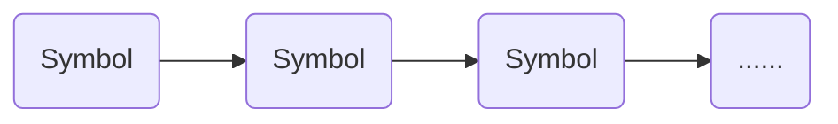
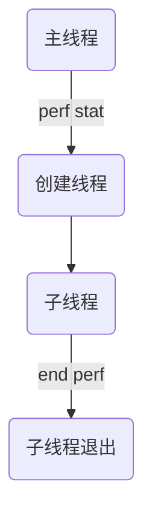

Details
============
以下示例中所使用API及其参数的详细介绍，可参考C_C++_API、Go_API和Python_API文档。

### Counting
libkperf提供Counting模式，类似于perf stat功能。
例如，如下perf命令:
```
perf stat -e cycles,branch-misses
```
该命令是对系统采集cycles和branch-misses这两个事件的计数。

对于libkperf，可以这样来设置PmuAttr：

```c++
// c++代码示例片段
char *evtList[2];
evtList[0] = "cycles";
evtList[1] = "branch-misses";
PmuAttr attr = {0};
attr.evtList = evtList;
attr.numEvt = 2;
int pd = PmuOpen(COUNTING, &attr);
if (pd == -1) {
   printf("kperf pmuopen counting failed: ", Perror());
}
```

```python
# python代码示例片段
import time
import kperf

evtList = ["cycles", "branch-misses"]
pmu_attr = kperf.PmuAttr(evtList=evtList)
pd = kperf.open(kperf.PmuTaskType.COUNTING, pmu_attr)
if pd == -1:
    print(kperf.error())
    exit(1)
```

```go
// go代码示例片段
import "libkperf/kperf"
import "fmt"

func main() {
    attr := kperf.PmuAttr{EvtList:[]string{"cycles", "branch-misses"}}
    pd, err := kperf.PmuOpen(kperf.COUNT, attr)
	if err != nil {
		fmt.Printf("kperf pmuopen counting failed, expect err is nil, but is %v", err)
        return
	}
}

```

通过调用```PmuOpen```初始化了采集任务，并获得了任务的标识符pd。
然后，可以利用pd来启动采集：
```c++
// c++代码示例片段
PmuEnable(pd);
sleep(any_duration);
PmuDisable(pd);
```

```python
# python代码示例片段
kperf.enable(pd)
time.sleep(1)
kperf.disable(pd)
```

```go
// go代码示例片段
kperf.PmuEnable(pd)
time.Sleep(time.Second)
kperf.PmuDisable(pd)
```
不论是否停止了采集，都可以通过```PmuRead```来读取采集数据：
```c++
// c++代码示例片段
PmuData *data = NULL;
int len = PmuRead(pd, &data);
```
```PmuRead```会返回采集数据的长度。
                                              
```python
# python代码示例片段
pmu_data = kperf.read(pd)
for data in pmu_data.iter:
    print(f"cpu {data.cpu} count {data.count} evt {data.evt}")
```
```kperf.read```会返回采集数据链表,可以通过遍历的方式读取。

```go
// go代码示例片段
dataVo, err := kperf.PmuRead(fd)
if err != nil {
    fmt.Printf("kperf pmuread failed, expect err is nil, but is %v\n", err)
    return
}

for _, o := range dataVo.GoData {
    fmt.Printf("cpu %v count %v evt %v\n", o.Cpu, o.Count, o.Evt)
}
```

```kperf.PmuRead```会返回数据结构体PmuDataVo, PmuDataVo中有转换成GO数据的结构体列表<GoData>
可以遍历读取

如果是对系统采集，那么PmuData的长度等于core的数量乘以事件的数量，PmuData的数据类似如下：
```
cpu 0 count 123     evt cycles
cpu 1 count 1242354 evt cycles
cpu 2 count 7897234 evt cycles
...
cpu 0 count 423423  evt branch-misses
cpu 1 count 124235  evt branch-misses
cpu 2 count 789723  evt branch-misses
...
```
如果是对进程采集，那么PmuData的长度等于进程内线程的数量乘以事件的数量，PmuData的数据类似如下：
```
pid 4156 tid 4156 count 123     evt cycles
pid 4156 tid 4157 count 534123  evt cycles
pid 4156 tid 4158 count 1241244 evt cycles
...
pid 4156 tid 4156 count 12414 evt branch-misses
pid 4156 tid 4157 count 5123  evt branch-misses
pid 4156 tid 4158 count 64574 evt branch-misses
...
```

完整的counting采集示例代码见READ.md文档相关章节：C++ [编译运行示例程序](../README.md), Python [Python:读取PMU计数](../README.md), Go [Go:读取PMU计数](../README.md)

#### User Access Counting

部分core事件支持直接读取寄存器的方式采集计数。libkperf限制此特性在内核v6.6之后支持。需要执行`sudo sysctl kernel/perf_user_access=1`开启。

通过此方式采集计数时，需要设置:
- attr.enableUserAccess=1
- pidList[1]={0}
- cpuList[1]={-1}

且只能采集当前进程。推荐使用此方法对细粒度的代码片段进行事件计数采集。

以下为完整示例：
<details>
    <summary>点击查看C++代码示例</summary>

```c++
#include <stdio.h>
#include <cstring>
#include "pcerrc.h"
#include "pmu.h"

int main() {
    PmuAttr attr = {0};
    attr.enableUserAccess = 1;

    char *evtList[2];
    evtList[0] = "cycles";
    evtList[1] = "branch-misses";
    attr.numEvt = 2;
    attr.evtList = evtList;

    int pidList[1] = {0};
    attr.pidList = pidList;
    attr.numPid = 1;
    int cpuList[1] = {-1}; 
    attr.cpuList = cpuList;
    attr.numCpu = 1;

    int pd = PmuOpen(COUNTING, &attr);
    if (pd == -1) {
        printf("PmuOpen failed : %s\n", Perror());
        return 1;
    }
    int err = PmuEnable(pd);
    if (err != SUCCESS) {
        printf("PmuEnable failed: %s\n", Perror());
        PmuClose(pd);
        return 1;
    }
    PmuData *data = nullptr;
    int len = PmuRead(pd, &data);
    for (int i = 0; i < 2; i++) {
        int k = 1e8;
        while (k > 0) {
            k--;
        }
        PmuDataFree(data);
        len = PmuRead(pd, &data);
        if (len > 0) {
            for (int j = 0; j < len; j++) {
                printf("event:%s pid=%d tid=%d cpu=%d count=%llu\n",data[j].evt,data[j].pid,data[j].tid,data[j].cpu,data[j].count);
            }
        } else {
            printf("%s\n", Perror());
        }
    }
    PmuDisable(pd);
    PmuClose(pd);
    return 0;
}
```

</details>

<details>
    <summary>点击查看Python代码示例</summary>

```python
import kperf

evtList = ["cycles"]
pidList = [0]
cpuList = [-1]
pmu_attr = kperf.PmuAttr(evtList=evtList, pidList=pidList, cpuList=cpuList, enableUserAccess=True)
pd = kperf.open(kperf.PmuTaskType.COUNTING, pmu_attr)
if pd == -1:
    print(kperf.error())
    exit(1)
err = kperf.enable(pd)
if err != 0:
    print(kperf.error())
    exit(1)
pmu_data = kperf.read(pd)
for _ in range(3):
    i = 10000
    while i > 0:
        i = i - 1
    pmu_data = kperf.read(pd)
    assert len(pmu_data) > 0, "No read data"
    for data in pmu_data.iter:
        print(f"cpu {data.cpu} count {data.count} evt {data.evt}")
kperf.disable(pd)
kperf.close(pd)
```

</details>

<details>
    <summary>点击查看Go代码示例</summary>

```go
package main
import "libkperf/kperf"
import "fmt"

func main() {
    attr := kperf.PmuAttr{EvtList:[]string{"cycles"}, PidList:[]int{0}, CpuList:[]int{-1}, EnableUserAccess:true}
    fd, err := kperf.PmuOpen(kperf.COUNT, attr)
	if err != nil {
		fmt.Printf("perf user access counting open failed : %v\n", err)
        return
	}
	err = kperf.PmuEnable(fd)
    if err != nil {
        fmt.Printf("PmuEnable failed: %v", err)
        return
    }
	dataVo, err := kperf.PmuRead(fd)
	if err != nil {
		fmt.Printf("PmuRead failed: %v", err)
        return
	}
	for i, n := 0, 3; i < n; i++ {
		j := 0;
		for k := 0; k < 1000000; k++ {
			j = j + 1
		}
		dataVo, err = kperf.PmuRead(fd)
		if err != nil {
			fmt.Printf("PmuRead failed: %v", err)
            return
		}
		for _, o := range dataVo.GoData {
			fmt.Printf("evt=%v count=%v\n", o.Evt, o.Count)
		}
		kperf.PmuDataFree(dataVo)
	}
	kperf.PmuDisable(fd)
	kperf.PmuClose(fd)
}
```

</details>

#### Bpf Counting

多线程或cgroup采集场景下消耗大量文件资源描述符，同时较多的上下文切换会导致应用性能劣化。libkperf提供基于内核bpf的counting模式采集功能，此特性在内核v5.10版本后支持。

使用该模式采集，请确保内核选项CONFIG_DEBUG_INFO_BTF开启。编译libkperf时需添加'bpf=true'选项启动clang和bpftool工具编译bpf程序，并设置:
- attr.enableBpf=1
- pidList或cgroupNameList不为空

以采集进程为例，以下为完整示例：
<details>
    <summary>点击查看C++代码示例</summary>

```c++
#include <stdio.h>
#include <cstring>
#include <unistd.h>
#include "pcerrc.h"
#include "pmu.h"

int main() {
    PmuAttr attr = {0};
    attr.enableBpf = 1;

    char *evtList[2];
    evtList[0] = "cycles";
    evtList[1] = "branch-misses";
    attr.numEvt = 2;
    attr.evtList = evtList;

    int pid = 1;
    int pidList[1] = {pid};  // 该pid值替换成对应需要采集应用的pid
    attr.pidList = pidList;
    attr.numPid = 1;

    int pd = PmuOpen(COUNTING, &attr);
    if (pd == -1) {
        printf("PmuOpen failed : %s\n", Perror());
        return 1;
    }
    PmuEnable(pd);
    sleep(1);
    PmuDisable(pd);
    PmuData *data = nullptr;
    int len = PmuRead(pd, &data);
    if (len <= 0) {
        printf("%s\n", Perror());
    }
    for (int i = 0; i < len; i++) {
        printf("event:%s pid=%d tid=%d cpu=%d count=%llu\n",data[i].evt,data[i].pid,data[i].tid,data[i].cpu,data[i].count);
    }
    PmuDataFree(data);
    PmuClose(pd);
    return 0;
}
```

</details>

<details>
    <summary>点击查看Python代码示例</summary>

```python
import kperf
import time

evtList = ["cycles", "branch-misses"]
pidList = [1] # 该pid值替换成对应需要采集应用的pid
pmu_attr = kperf.PmuAttr(evtList=evtList, pidList=pidList, enableBpf=True)
pd = kperf.open(kperf.PmuTaskType.COUNTING, pmu_attr)
if pd == -1:
    print(f"PmuOpen failed ({kperf.errorno()}): {kperf.error()}")
    exit(1)
kperf.enable(pd)
time.sleep(1)
kperf.disable(pd)
pmu_data = kperf.read(pd)
if len(pmu_data) == 0:
    print(f"PmuRead returned no data ({kperf.errorno()}): {kperf.error()}")
for data in pmu_data.iter:
    print(f"cpu {data.cpu} evt {data.evt} count {data.count}")
kperf.close(pd)
```

</details>

<details>
    <summary>点击查看Go代码示例</summary>

```go
package main

import (
    "fmt"
    "os"
    "time"
    "libkperf/kperf"
)

func main() {
    pidList := []int{os.Getpid()}
    attr := kperf.PmuAttr{EvtList:[]string{"cycles", "branch-misses"}, PidList: pidList, EnableBpf: true}
	fd, err := kperf.PmuOpen(kperf.COUNT, attr)
	if err != nil {
		fmt.Printf("kperf pmuopen sample failed, expect err is nil, but is %v\n", err)
        return
	}

	kperf.PmuEnable(fd)
	time.Sleep(time.Second)
	kperf.PmuDisable(fd)

	dataVo, err := kperf.PmuRead(fd)
	if err != nil {
		fmt.Printf("kperf pmuread failed, expect err is nil, but is %v\n", err)
        return
	}
    for _, o := range dataVo.GoData {
        fmt.Printf("cpu=%v evt=%v count=%v\n", o.Cpu, o.Evt, o.Count)
    }
	kperf.PmuDataFree(dataVo)
	kperf.PmuClose(fd)
}
```

</details>

### Sampling
libkperf提供Sampling模式，类似于perf record的如下命令：
```
perf record -e cycles,branch-misses
```
该命令是对系统采样cycles和branch-misses这两个事件。

设置PmuAttr的方式和Counting一样，在调用PmuOpen的时候，把任务类型设置为SAMPLING，并且设置采样频率：
```c++
// c++代码示例
#include <cstdio>
#include <unistd.h>

#include "pcerrc.h"
#include "pmu.h"

int main()
{
    char cycles[] = "cycles";
    char *evtList[] = {cycles};
    PmuAttr attr = {0};
    attr.freq = 1000;
    attr.useFreq = 1;
    attr.evtList = evtList;
    attr.numEvt = 1;

    int pd = PmuOpen(SAMPLING, &attr);
    if (pd == -1) {
        std::fprintf(stderr, "PmuOpen failed: %s\n", Perror());
        return 1;
    }
    PmuEnable(pd);
    sleep(1);
    PmuDisable(pd);

    PmuData *data = nullptr;
    int len = PmuRead(pd, &data);
    if (len < 0) {
        std::fprintf(stderr, "PmuRead failed: %s\n", Perror());
        PmuClose(pd);
        return 1;
    }
    for (int i = 0; i < len; ++i) {
        std::printf("cpu=%d pid=%d tid=%d period=%llu\n", data[i].cpu, data[i].pid,
                    data[i].tid, static_cast<unsigned long long>(data[i].period));
    }

    PmuDataFree(data);
    PmuClose(pd);
    return 0;
}
```

```python
# python代码示例
import kperf
import ksym
import time

evtList = ["branch-misses", "cycles"]
pmu_attr = kperf.PmuAttr(
        evtList=evtList,
        sampleRate=1000, # 采样频率是1000HZ
        symbolMode=kperf.SymbolMode.RESOLVE_ELF
    )
pd = kperf.open(kperf.PmuTaskType.SAMPLING, pmu_attr)
if pd == -1:
    print(f"PmuOpen failed ({kperf.errorno()}): {kperf.error()}")
    exit(1)
try:
    kperf.enable(pd)
    time.sleep(1)
    kperf.disable(pd)
    pmu_data = kperf.read(pd)
    if len(pmu_data) == 0:
        print(f"PmuRead returned no data ({kperf.errorno()}): {kperf.error()}")
        exit(1)
    for item in pmu_data.iter:
        print(f"cpu {item.cpu} pid {item.pid} tid {item.tid} period {item.period}")
finally:
    kperf.close(pd)
```

```go
//go代码示例
package main

import "libkperf/kperf"
import "fmt"
import "time"

func main() {
    attr := kperf.PmuAttr{EvtList:[]string{"cycles"}, SymbolMode:kperf.ELF, SampleRate: 1000}
    pd, err := kperf.PmuOpen(kperf.SAMPLE, attr)
	if err != nil {
		fmt.Printf("kperf pmuopen sample failed, expect err is nil, but is %v\n", err)
        return
	}
    kperf.PmuEnable(pd)
    time.Sleep(time.Second)
    kperf.PmuDisable(pd)
    dataVo, err := kperf.PmuRead(pd)
    if err != nil {
        fmt.Printf("kperf pmuread failed, expect err is nil, but is %v\n", err)
        return
    }
    for _, o := range dataVo.GoData {
        fmt.Printf("cpu=%d pid=%d tid=%d period=%v\n", o.Cpu, o.Pid, o.Tid, o.Period)
    }
    kperf.PmuDataFree(dataVo)
    kperf.PmuClose(pd)
}
```

启动采集和读取数据的方式和Counting一致。
如果是对系统采集，PmuData的数据类似如下（长度取决于数据量）：
```
cpu 0 pid 3145 tid 3145 period 12314352
cpu 0 pid 4145 tid 4145 period 12314367
...
cpu 1 pid 23423 tid 23423 period 1231241
...
...
```
如果是对进程采集，PmuData的数据类似如下：
```
cpu 32 pid 7878 tid 7878 period 123144
cpu 32 pid 7878 tid 7879 period 1523342
cpu 32 pid 7878 tid 7879 period 1234342
...
```
每一条记录还包含触发事件的程序地址和符号信息，关于如何获取符号信息，可以参考[获取符号信息](#获取符号信息)这一章节。

### SPE Sampling
libkperf提供SPE采样模式，类似于perf record的如下命令：
```
perf record -e arm_spe_0/load_filter=1/
```
该命令是对系统进行spe采样，关于linux spe采样的详细介绍，可以参考[这里](https://www.man7.org/linux/man-pages/man1/perf-arm-spe.1.html)。

> **注意：** 容器内使用SPE采集指定进程时，若未使用宿主机PID namespace，可能因无法匹配到目标PID导致无数据。建议在宿主机进行采集。

对于libkperf，可以这样设置PmuAttr：
```c++
// c++代码示例
#include <cstdio>
#include <unistd.h>

#include "pcerrc.h"
#include "pmu.h"

int main()
{
    PmuAttr attr = {0};
    attr.period = 8192;
    attr.dataFilter = LOAD_FILTER;

    int pd = PmuOpen(SPE_SAMPLING, &attr);
    if (pd == -1) {
        std::fprintf(stderr, "PmuOpen failed: %s\n", Perror());
        return 1;
    }
    PmuEnable(pd);
    sleep(1);
    PmuDisable(pd);

    PmuData *data = nullptr;
    int len = PmuRead(pd, &data);
    if (len < 0) {
        std::fprintf(stderr, "PmuRead failed: %s\n", Perror());
        PmuClose(pd);
        return 1;
    }
    for (int i = 0; i < len; ++i) {
        const PmuData &item = data[i];
        std::printf("spe base info comm=%s, pid=%d, tid=%d, coreId=%d, numaId=%d, socketId=%d\n",
                    item.comm, item.pid, item.tid, item.cpuTopo->coreId,
                    item.cpuTopo->numaId, item.cpuTopo->socketId);
        if (item.ext != nullptr) {
            std::printf("spe ext info pa=%lu, va=%lu, event=%lu, latency=%u\n",
                        item.ext->pa, item.ext->va, item.ext->event, item.ext->lat);
        }
    }

    PmuDataFree(data);
    PmuClose(pd);
    return 0;
}
```

```python
# python代码示例
import kperf
import ksym
import time

pmu_attr = kperf.PmuAttr(
    sampleRate = 8192,
    dataFilter = kperf.SpeFilter.LOAD_FILTER,
) 
# 需要root权限才能运行
pd = kperf.open(kperf.PmuTaskType.SPE_SAMPLING, pmu_attr)
if pd == -1:
    print(f"PmuOpen failed ({kperf.errorno()}): {kperf.error()}")
    exit(1)
try:
    kperf.enable(pd)
    time.sleep(1)
    kperf.disable(pd)
    pmu_data = kperf.read(pd)
    if len(pmu_data) == 0:
        print(f"PmuRead returned no data ({kperf.errorno()}): {kperf.error()}")
        exit(1)
    for item in pmu_data.iter:
        print(f"spe base info comm={item.comm}, pid={item.pid}, tid={item.tid}, coreId={item.cpuTopo.coreId}, numaId={item.cpuTopo.numaId}, sockedId={item.cpuTopo.socketId}")
        print(f"spe ext info pa={item.ext.pa}, va={item.ext.va}, event={item.ext.event}, latency={item.ext.lat}\n")
finally:
    kperf.close(pd)
```

```go
// go代码示例
package main

import "libkperf/kperf"
import "fmt"
import "time"

func main() {
    attr := kperf.PmuAttr{SampleRate:8192, DataFilter: kperf.LOAD_FILTER}
    pd, err := kperf.PmuOpen(kperf.SPE, attr)
    if err != nil {
        fmt.Printf("kperf pmuopen spe failed, expect err is nil, but is %v\n", err)
        return
    }

	kperf.PmuEnable(pd)
	time.Sleep(time.Second)
	kperf.PmuDisable(pd)

	dataVo, err := kperf.PmuRead(pd)
	if err != nil {
		fmt.Printf("kperf pmuread failed, expect err is nil, but is %v\n", err)
		return
	}

	for _, o := range dataVo.GoData {
		fmt.Printf("spe base info comm=%v, pid=%v, tid=%v, coreId=%v, numaId=%v, sockedId=%v\n", o.Comm, o.Pid, o.Tid, o.CpuTopo.CoreId, o.CpuTopo.NumaId, o.CpuTopo.SocketId)
		fmt.Printf("spe ext info pa=%v, va=%v, event=%v, latency=%v\n", o.SpeExt.Pa, o.SpeExt.Va, o.SpeExt.Event, o.SpeExt.Lat)
	}
	kperf.PmuDataFree(dataVo)
    kperf.PmuClose(pd)
}

```

对于spe采样，不需要设置evtList，而是通过设置dataFilter和evFilter来指定需要采集的事件。dataFilter和evFilter的含义仍然可以参考[perf spe的说明文档](https://www.man7.org/linux/man-pages/man1/perf-arm-spe.1.html)。

采样数据PmuData和Sampling模式差不多，差别是：
- SPE采样的调用栈只有一层，而Sampling可以有多层调用栈。
- SPE的PmuData提供了额外的数据struct PmuDataExt *ext.
PmuDataExt包含spe特有的数据：访存的物理地址、虚拟地址和事件bit。
```text
struct PmuDataExt {
    unsigned long pa;               // physical address
    unsigned long va;               // virtual address
    unsigned long event;            // event id, which is a bit map of mixed events, event bit is defined in SPE_EVENTS.
    unsigned short lat; // latency, Number of cycles between the time when an operation is dispatched and the time when the operation is executed.
    unsigned short source;          // data source, used to record the source of data accessed by a load operation, it can distinguish whether false sharing occurs.
};
```
其中，物理地址pa需要在启用PA_ENABLE的情况下才能采集。
event是一个bit map，是多个事件的集合，每一个事件占据一个bit，事件对应的bit参考枚举SPE_EVENTS：
```text
enum SPE_EVENTS {
    SPE_EV_EXCEPT       = 1 << 0,
    SPE_EV_RETIRED      = 1 << 1,
    SPE_EV_L1D_ACCESS   = 1 << 2,
    SPE_EV_L1D_REFILL   = 1 << 3,
    SPE_EV_TLB_ACCESS   = 1 << 4,
    SPE_EV_TLB_WALK     = 1 << 5,
    SPE_EV_NOT_TAKEN    = 1 << 6,
    SPE_EV_MISPRED      = 1 << 7,
    SPE_EV_LLC_ACCESS   = 1 << 8,
    SPE_EV_LLC_MISS     = 1 << 9,
    SPE_EV_REMOTE_ACCESS= 1 << 10,
    SPE_EV_ALIGNMENT    = 1 << 11,
    SPE_EV_PARTIAL_PRED = 1 << 17,
    SPE_EV_EMPTY_PRED   = 1 << 18,
};
```
对于PmuDataExt中的source字段，以下记录不同加载或存储操作对应的bit值
```text
enum HIP_DATA_SOURCE {
    HIP_PEER_CPU            = 0,
    HIP_PEER_CPU_HITM       = 1,
    HIP_L3                  = 2,
    HIP_L3_HITM             = 3,
    HIP_PEER_CLUSTER        = 4,
    HIP_PEER_CLUSTER_HITM   = 5,
    HIP_REMOTE_SOCKET       = 6,
    HIP_REMOTE_SOCKET_HITM  = 7,
    HIP_LOCAL_MEM           = 8,
    HIP_REMOTE_MEM          = 9,
    HIP_NC_DEV              = 13,
    HIP_L2                  = 16,
    HIP_L2_HITM             = 17,
    HIP_L1                  = 18,
};
```
### 获取符号信息
结构体PmuData里提供了采样数据的调用栈信息，包含调用栈的地址、符号名称等。
```text
struct Symbol {
    unsigned long addr;
    char* module;
    char* symbolName;
    char* fileName;
    unsigned int lineNum;
    ...
};

struct Stack {
    struct Symbol* symbol;
    struct Stack* next;
    struct Stack* prev;
    ...
} __attribute__((aligned(64)));
```

Stack是链表结构，每一个元素都是一层调用函数。

```mermaid
graph LR
a(Symbol) --> b(Symbol)
b --> c(Symbol)
c --> d(......)
```

Symbol的字段信息受PmuAttr影响：
- PmuAttr.callStack会决定Stack是完整的调用栈，还是只有一层调用栈（即Stack链表只有一个元素）。
- PmuAttr.symbolMode如果等于NO_SYMBOL_RESOLVE，那么PmuData的stack是空指针。
- PmuAttr.symbolMode如果等于RESOLVE_ELF，那么Symbol的fileName和lineNum没有数据，都等于0，因为没有解析dwarf信息（注:kernel的fileName为'[kernel]'）。
- PmuAttr.symbolMode如果等于RESOLVE_ELF_DWARF，那么Symbol的所有信息都有效。

### 采集uncore事件
libkperf支持uncore事件的采集，只有Counting模式支持uncore事件的采集（和perf一致）。
可以像这样设置PmuAttr：
```c++
// c++代码示例
#include <cstdio>
#include <unistd.h>

#include "pcerrc.h"
#include "pmu.h"

int main()
{
    char readFlux[] = "hisi_sccl1_ddrc0/flux_rd/";
    char *evtList[] = {readFlux};
    PmuAttr attr = {0};
    attr.evtList = evtList;
    attr.numEvt = 1;

    int pd = PmuOpen(COUNTING, &attr);
    if (pd == -1) {
        std::fprintf(stderr, "PmuOpen failed: %s\n", Perror());
        return 1;
    }
    PmuEnable(pd);
    sleep(1);
    PmuDisable(pd);

    PmuData *data = nullptr;
    int len = PmuRead(pd, &data);
    if (len < 0) {
        std::fprintf(stderr, "PmuRead failed: %s\n", Perror());
        PmuClose(pd);
        return 1;
    }
    for (int i = 0; i < len; ++i) {
        std::printf("evt=%s, count=%llu\n", data[i].evt,
                    static_cast<unsigned long long>(data[i].count));
    }

    PmuDataFree(data);
    PmuClose(pd);
    return 0;
}
```

```python
# python代码示例
import kperf
import time

evtList = ["hisi_sccl1_ddrc0/flux_rd/"]
pmu_attr = kperf.PmuAttr(evtList=evtList)
pd = kperf.open(kperf.PmuTaskType.COUNTING, pmu_attr)
if pd == -1:
    print(f"PmuOpen failed ({kperf.errorno()}): {kperf.error()}")
    exit(1)
try:
    kperf.enable(pd)
    time.sleep(1)
    kperf.disable(pd)
    pmu_data = kperf.read(pd)
    if len(pmu_data) == 0:
        print(f"PmuRead returned no data ({kperf.errorno()}): {kperf.error()}")
        exit(1)
    for item in pmu_data.iter:
        print(f"evt={item.evt} count={item.count}")
finally:
    kperf.close(pd)
```

```go
// go代码示例
package main

import "libkperf/kperf"
import "fmt"
import "time"

func main() {
    evtList := []string{"hisi_sccl1_ddrc0/flux_rd/"}
    attr := kperf.PmuAttr{EvtList:evtList}
	pd, err := kperf.PmuOpen(kperf.COUNT, attr)
	if err != nil {
		fmt.Printf("kperf pmuopen counting failed, expect err is nil, but is %v\n", err)
        return
	}
    kperf.PmuEnable(pd)
    time.Sleep(time.Second)
    kperf.PmuDisable(pd)
    dataVo, err := kperf.PmuRead(pd)
    if err != nil {
        fmt.Printf("kperf pmuread failed, expect err is nil, but is %v\n", err)
        return
    }
    for _, o := range dataVo.GoData {
        fmt.Printf("evt=%v count=%v \n", o.Evt, o.Count)
    }
    kperf.PmuDataFree(dataVo)
    kperf.PmuClose(pd)
}
```

uncore事件的格式为```<device>/<event>/```，上面代码是采集设备hisi_sccl1_ddrc0的flux_rd事件。

也可以把设备索引号省略：
```c++
// c++代码示例
evtList[0] = "hisi_sccl1_ddrc/flux_rd/";
```

```python
# python代码示例
evtList = ["hisi_sccl1_ddrc/flux_rd/"]
```

```goa
// go代码示例
evtList := []string{"hisi_sccl1_ddrc/flux_rd/"}
```

这里把hisi_sccl1_ddrc0改为了hisi_sccl1_ddrc，这样会采集设备hisi_sccl1_ddrc0、hisi_sccl1_ddrc1、hisi_sccl1_ddrc2...，并且采集数据PmuData是所有设备数据的总和：count = count(hisi_sccl1_ddrc0) + count(hisi_sccl1_ddrc1) + count(hisi_sccl1_ddrc2) + ...

也可以通过```<device>/config=0xxx/```的方式来指定事件名：
```c++
// c++代码示例
evtList[0] = "hisi_sccl1_ddrc0/config=0x1/";
```

```python
# python代码示例
evtList = ["hisi_sccl1_ddrc0/config=0x1/"]
```

```go
// go代码示例
evtList := []string{"hisi_sccl1_ddrc0/config=0x1/"}
```

这样效果是和指定flux_rd是一样的。

### 采集tracepoint
libkperf支持tracepoint的采集，支持的tracepoint事件可以通过perf list来查看（通常需要root权限）。
可以这样设置PmuAttr：
```c++
// c++代码示例
#include <iostream>
#include "symbol.h"
#include "pmu.h"
#include "pcerrc.h"
#include "pmu.h"

int main()
{
    char schedSwitch[] = "sched:sched_switch";
    char *evtList[] = {schedSwitch};
    PmuAttr attr = {0};
    attr.evtList = evtList;
    attr.numEvt = 1;
    attr.period = 1000;

    int pd = PmuOpen(SAMPLING, &attr);
    if (pd == -1) {
        std::fprintf(stderr, "PmuOpen failed: %s\n", Perror());
        return 1;
    }
    PmuEnable(pd);
    sleep(1);
    PmuDisable(pd);

    PmuData *data = nullptr;
    int len = PmuRead(pd, &data);
    if (len < 0) {
        std::fprintf(stderr, "PmuRead failed: %s\n", Perror());
        PmuClose(pd);
        return 1;
    }
    for (int i = 0; i < len; ++i) {
        int prevPid = 0;
        char nextComm[16] = {};
        if (PmuGetField(data[i].rawData, "prev_pid", &prevPid, sizeof(prevPid)) != SUCCESS ||
            PmuGetField(data[i].rawData, "next_comm", nextComm, sizeof(nextComm)) != SUCCESS) {
            std::fprintf(stderr, "PmuGetField failed: %s\n", Perror());
            continue;
        }
        std::printf("next_comm=%s;prev_pid=%d\n", nextComm, prevPid);
    }

    PmuDataFree(data);
    PmuClose(pd);
    return 0;
}
```

```text
# Python 配置片段（完整程序见下方）
pmu_attr = kperf.PmuAttr(evtList=["sched:sched_switch"], sampleRate=1000)
```

```text
// Go 配置片段（完整程序见下方）
attr := kperf.PmuAttr{EvtList: []string{"sched:sched_switch"}, SampleRate: 1000}
```

tracepoint支持Counting和Sampling两种模式，API调用流程和两者相似。
tracepoint能够获取每个事件特有的数据，比如sched:sched_switch包含的数据有：prev_comm, prev_pid, prev_prio, prev_state, next_comm, next_pid, next_prio.
想要查询每个事件包含哪些数据，可以查看/sys/kernel/tracing/events下面的文件内容，比如/sys/kernel/tracing/events/sched/sched_switch/format。

libkperf提供了接口PmuGetField来获取tracepoint的数据。上面的完整 C++ 示例展示了如何读取 `sched:sched_switch` 的 `prev_pid` 和 `next_comm` 字段。

```python
# python代码示例
import kperf
import time
from ctypes import *

attr = kperf.PmuAttr(evtList=["sched:sched_switch"], sampleRate=1000)
pd = kperf.open(kperf.PmuTaskType.SAMPLING, attr)
if pd == -1:
    print(f"PmuOpen failed ({kperf.errorno()}): {kperf.error()}")
    exit(1)
kperf.enable(pd)
time.sleep(1)
kperf.disable(pd)
pmu_data = kperf.read(pd)
if len(pmu_data) == 0:
    print(f"PmuRead returned no data ({kperf.errorno()}): {kperf.error()}")
for data in pmu_data.iter:
    next_comm = create_string_buffer(128) #该长度可适当减少，但最好设置比最终获取的长度大，否则最终将无法获取对应结果。
    kperf.get_field(data, "next_comm", next_comm)
    next_comm = next_comm.value.decode("utf-8")

    prev_pid = c_uint(0)
    kperf.get_field(data, "prev_pid", pointer(prev_pid))

    print(f"next_comm={next_comm};prev_pid={prev_pid.value}")
kperf.close(pd)
```
这里调用者需要提前了解数据的类型，并且指定数据的大小。数据的类型和大小仍然可以从/sys/kernel/tracing/下每个事件的format文件来得知。

```go
// go代码示例
package main

import "libkperf/kperf"
import "time"
import "fmt"
import "C"
import "unsafe"

func main() {
    attr := kperf.PmuAttr{EvtList:[]string{"sched:sched_switch"}, SymbolMode:kperf.ELF, SampleRate: 1000}
    pd, err := kperf.PmuOpen(kperf.SAMPLE, attr)
    if err != nil {
        fmt.Printf("kperf pmuopen sample failed, expect err is nil, but is %v\n", err)
        return
    }
    kperf.PmuEnable(pd)
	time.Sleep(time.Second)
	kperf.PmuDisable(pd)

	dataVo, err := kperf.PmuRead(pd)
	if err != nil {
		fmt.Printf("kperf pmuread failed, expect err is nil, but is %v\n", err)
        return
	}
    for _, v := range dataVo.GoData {
		var cArray [128]C.char // 必须不小于 format 中 next_comm 字段的大小（sched_switch 为 16）。
        nextErr := v.GetField("next_comm", unsafe.Pointer(&cArray))
        if nextErr != nil {
            fmt.Printf("get next_comm failed err is%v\n",nextErr)
        } else {
            ptr := (*C.char)(unsafe.Pointer(&cArray[0]))
            fmt.Printf("next_comm=%v\n", C.GoString(ptr))
        }

        prevPid := C.int(0)
        prevPidErr := v.GetField("prev_pid", unsafe.Pointer(&prevPid))
        if prevPidErr != nil {
            fmt.Printf("get prev_pid err %v\n", prevPidErr)
        } else {
            fmt.Printf("prev=%v\n", int(prevPid))
        }
	}
    kperf.PmuDataFree(dataVo)
    kperf.PmuClose(pd)
}

```

### 事件分组
libkperf提供了事件分组的能力，能够让多个事件同时处于采集状态。
该功能类似于perf的如下使用方式：
```
perf stat -e "{cycles,branch-loads,branch-load-misses,iTLB-loads}",inst_retired
```

如果对多个相关联的事件采集，可以把关联的事件放到一个事件组。比如，计算bad speculation需要用到事件inst_retired，inst_spec和cycles，计算retiring需要用到事件inst_retired和cycles。那么perf应该这样使用：
```
perf stat -e "{inst_retired,inst_spec,cycles}","{inst_retired,cycles}"
```

> **注意：** 设置事件分组的情况下采集多个cgroup，groupId将会被设置为内部键值

用libkperf可以这样实现：
```c++
#include <iostream>
#include <map>
#include <cstdint>
#include <unistd.h>

#include "pcerrc.h"
#include "pmu.h"

int main()
{
    char instRetired1[] = "inst_retired";
    char instSpec[] = "inst_spec";
    char cycles1[] = "cycles";
    char instRetired2[] = "inst_retired";
    char cycles2[] = "cycles";
    char *evtList[5] = {instRetired1, instSpec, cycles1, instRetired2, cycles2};
    EvtAttr attrList[5] = {{1}, {1}, {1}, {2}, {2}};
    PmuAttr attr = {0};
    attr.evtList = evtList;
    attr.numEvt = 5;
    attr.evtAttr = attrList;
    attr.numEvtAttr = 5;

    int pd = PmuOpen(COUNTING, &attr);
    if (pd == -1) {
        std::cerr << "PmuOpen failed: " << Perror() << '\n';
        return 1;
    }
    PmuEnable(pd);
    sleep(1);
    PmuDisable(pd);

    PmuData *data = nullptr;
    int len = PmuRead(pd, &data);
    if (len < 0) {
        std::cerr << "PmuRead failed: " << Perror() << '\n';
        PmuClose(pd);
        return 1;
    }
    std::map<int, std::map<std::string, uint64_t>> evtMap;
    for (int i = 0; i < len; ++i) {
        evtMap[data[i].groupId][data[i].evt] += data[i].count;
    }
    if (evtMap[1]["cycles"] != 0 && evtMap[2]["cycles"] != 0) {
        std::cout << "bad spec: " << static_cast<double>(evtMap[1]["inst_spec"] - evtMap[1]["inst_retired"]) / evtMap[1]["cycles"] << '\n';
        std::cout << "retiring: " << static_cast<double>(evtMap[2]["inst_retired"]) / (6 * evtMap[2]["cycles"]) << '\n';
    }

    PmuDataFree(data);
    PmuClose(pd);
    return 0;
}
```

```python
# python代码示例
import kperf
import time
from collections import defaultdict

evtList = ["inst_retired", "inst_spec", "cycles", "inst_retired", "cycles"]
# 指定事件分组编号，前三个事件为一组，后两个事件为一组。
evtAttrList = [kperf.EvtAttr(1),kperf.EvtAttr(1),kperf.EvtAttr(1),kperf.EvtAttr(2),kperf.EvtAttr(2)]
pmu_attr = kperf.PmuAttr(evtList=evtList, evtAttr = evtAttrList)
pd = kperf.open(kperf.PmuTaskType.COUNTING, pmu_attr)
if pd == -1:
    print(f"PmuOpen failed ({kperf.errorno()}): {kperf.error()}")
    exit(1)
try:
    kperf.enable(pd)
    time.sleep(1)
    kperf.disable(pd)
    pmu_data = kperf.read(pd)
    if len(pmu_data) == 0:
        print(f"PmuRead returned no data ({kperf.errorno()}): {kperf.error()}")
        exit(1)
    evtMap = defaultdict(lambda: defaultdict(int))
    for data in pmu_data.iter:
        evtMap[data.groupId][data.evt] += data.count
    if evtMap[1]["cycles"] == 0 or evtMap[2]["cycles"] == 0:
        print("Cannot calculate grouped metrics because the cycles count is zero")
        exit(1)
    bad_spec = (evtMap[1]["inst_spec"] - evtMap[1]["inst_retired"]) / evtMap[1]["cycles"]
    retiring = evtMap[2]["inst_retired"] / (6 * evtMap[2]["cycles"])
    print(f"bad spec: {bad_spec}")
    print(f"retiring: {retiring}")
finally:
    kperf.close(pd)
```

```go
// go代码示例
package main

import "libkperf/kperf"
import "fmt"
import "time"

func main() {
    evtList := []string{"inst_retired", "inst_spec", "cycles", "inst_retired", "cycles"}
    evtAttrList := []kperf.EvtAttr{kperf.EvtAttr{1,0,false,false},kperf.EvtAttr{1,0,false,false},kperf.EvtAttr{1,0,false,false},kperf.EvtAttr{2,0,false,false},kperf.EvtAttr{2,0,false,false}}
    attr := kperf.PmuAttr{EvtList: evtList, EvtAttr: evtAttrList}
    pd, err := kperf.PmuOpen(kperf.COUNT, attr)
    if err != nil {
        fmt.Printf("kperf pmuopen sample failed, expect err is nil, but is %v\n", err)
        return
    }
    kperf.PmuEnable(pd)
    time.Sleep(time.Second)
    kperf.PmuDisable(pd)

    dataVo, err := kperf.PmuRead(pd)
    if err != nil {
        fmt.Printf("kperf pmuread failed, expect err is nil, but is %v\n", err)
        return
    }

    evtMap := make(map[int]map[string]uint64)
	for _, data := range dataVo.GoData {
		groupId := data.GroupId
		evt := data.Evt
		if _, ok := evtMap[groupId]; !ok {
			evtMap[groupId] = make(map[string]uint64)
		}
		evtMap[groupId][evt] += data.Count
	}

	if group1, ok1 := evtMap[1]; ok1 {
		if instSpec, ok2 := group1["inst_spec"]; ok2 {
			if instRetired, ok3 := group1["inst_retired"]; ok3 {
				if cycles, ok4 := group1["cycles"]; ok4 && cycles != 0 {
					fmt.Printf("bad spec: %f\n", float64(instSpec-instRetired)/float64(cycles))
				}
			}
		}
	}
	if group2, ok1 := evtMap[2]; ok1 {
        if instRetired, ok2 := group2["inst_retired"]; ok2 {
            if cycles, ok3 := group2["cycles"]; ok3 && cycles != 0 {
                fmt.Printf("retiring: %f\n", float64(instRetired)/float64(6*cycles))
            }
        }
    }

    kperf.PmuDataFree(dataVo)
    kperf.PmuClose(pd)
}
```
事件分组的效果可以从PmuData.countPercent来体现。PmuData.countPercent表示事件实际采集时间除以事件期望采集时间。
对于同一组的事件，他们的countPercent是相同的。如果一个组的事件过多，超过了硬件计数器的数目，那么这个组的所有事件都不会被采集，countPercent会等于-1.

### 对进程子线程计数采集

```mermaid
graph TD
a(主线程) --perf stat--> b(创建线程)
b --> c(子线程)
c --end perf--> d(子线程退出)
```
考虑上面的场景：用perf stat对进程采集，之后进程创建了子线程，采集一段事件后，停止perf。
查看采集结果，perf只会显示主线程的采集结果，而无法看到子线程的结果：count = count(main thread) + count(thread). perf把子线程的数据聚合到了主线程上。

libkperf提供了采集子线程的能力。如果想要在上面场景中获取子线程的计数，可以在完整 Counting 示例的 `PmuOpen` 调用前设置 `attr.includeNewFork = 1`。
```text
# Python 配置片段
pmu_attr = kperf.PmuAttr(evtList=evtList, includeNewFork=True)
```
然后，通过PmuRead获取到的PmuData，便能包含子线程计数信息了。

> **注意：** 该功能是针对Counting模式，因为Sampling和SPE Sampling本身就会采集子线程的数据。

### 采集DDRC带宽
鲲鹏上提供了DDRC的pmu设备，用于采集DDR的性能数据，比如带宽等。libkperf提供了API，用于获取每个channel的DDR带宽数据。

参考代码：
```c++
// c++代码示例
#include <cstdio>
#include <iostream>
#include <unistd.h>

#include "pcerrc.h"
#include "pmu.h"

int main()
{
    PmuDeviceAttr devAttr[2] = {};
    devAttr[0].metric = PMU_DDR_READ_BW;
    devAttr[1].metric = PMU_DDR_WRITE_BW;

    int pd = PmuDeviceOpen(devAttr, 2);
    if (pd == -1) {
        std::fprintf(stderr, "PmuDeviceOpen failed (%d): %s\n", Perrorno(), Perror());
        return 1;
    }
    PmuEnable(pd);
    sleep(1);
    PmuDisable(pd);

    PmuData *oriData = nullptr;
    int oriLen = PmuRead(pd, &oriData);
    if (oriLen < 0) {
        std::fprintf(stderr, "PmuRead failed (%d): %s\n", Perrorno(), Perror());
        PmuClose(pd);
        return 1;
    }
    PmuDeviceData *devData = nullptr;
    int len = PmuGetDevMetric(oriData, oriLen, devAttr, 2, &devData);
    if (len < 0) {
        std::fprintf(stderr, "PmuGetDevMetric failed (%d): %s\n", Perrorno(), Perror());
        PmuDataFree(oriData);
        PmuClose(pd);
        return 1;
    }

    for (int i = 0; i < len; ++i) {
        const char *direction = devData[i].metric == PMU_DDR_READ_BW ? "read" : "write";
        std::cout << direction << " bandwidth(Socket: " << devData[i].socketId
                  << " Numa: " << devData[i].ddrNumaId << " Channel: "
                  << devData[i].channelId << "): " << devData[i].count / 1024 / 1024
                  << " M/s\n";
    }

    DevDataFree(devData);
    PmuDataFree(oriData);
    PmuClose(pd);
    return 0;
}
```

```python
# python代码示例
import kperf
import time

dev_attr = [
    kperf.PmuDeviceAttr(metric=kperf.PmuDeviceMetric.PMU_DDR_READ_BW),
    kperf.PmuDeviceAttr(metric=kperf.PmuDeviceMetric.PMU_DDR_WRITE_BW)
]
pd = kperf.device_open(dev_attr)
if pd == -1:
    print(f"PmuDeviceOpen failed ({kperf.errorno()}): {kperf.error()}")
    exit(1)
try:
    kperf.enable(pd)
    time.sleep(1)
    kperf.disable(pd)
    ori_data = kperf.read(pd)
    if len(ori_data) == 0:
        print(f"PmuRead returned no data ({kperf.errorno()}): {kperf.error()}")
        exit(1)
    dev_data = kperf.get_device_metric(ori_data, dev_attr)
    if len(dev_data) == 0:
        print(f"PmuGetDevMetric returned no data ({kperf.errorno()}): {kperf.error()}")
        exit(1)
    for data in dev_data.iter:
        if data.metric == kperf.PmuDeviceMetric.PMU_DDR_READ_BW:
            print(f"read bandwidth(Socket: {data.socketId} Numa: {data.ddrNumaId} Channel: {data.channelId}): {data.count/1024/1024} M/s")
        if data.metric == kperf.PmuDeviceMetric.PMU_DDR_WRITE_BW:
            print(f"write bandwidth(Socket: {data.socketId} Numa: {data.ddrNumaId} Channel: {data.channelId}): {data.count/1024/1024} M/s")
finally:
    kperf.close(pd)
```

```go
// go代码用例
package main

import (
    "fmt"
    "time"

    "libkperf/kperf"
)

func main() {
    attrs := []kperf.PmuDeviceAttr{
        {Metric: kperf.PMU_DDR_READ_BW},
        {Metric: kperf.PMU_DDR_WRITE_BW},
    }
    fd, err := kperf.PmuDeviceOpen(attrs)
    if err != nil {
        fmt.Printf("PmuDeviceOpen failed: %v\n", err)
        return
    }
    kperf.PmuEnable(fd)
    time.Sleep(time.Second)
    kperf.PmuDisable(fd)
    dataVo, err := kperf.PmuRead(fd)
    if err != nil {
        fmt.Printf("PmuRead failed: %v\n", err)
        return
    }
    deviceDataVo, err := kperf.PmuGetDevMetric(dataVo, attrs)
    if err != nil {
        fmt.Printf("PmuGetDevMetric failed: %v\n", err)
        return
    }
    defer kperf.DevDataFree(deviceDataVo)
    for _, data := range deviceDataVo.GoDeviceData {
        direction := "write"
        if data.Metric == kperf.PMU_DDR_READ_BW {
            direction = "read"
        }
        fmt.Printf("%s bandwidth(Socket: %v Numa: %v Channel: %v): %v M/s\n",
            direction, data.SocketId, data.DdrNumaId, data.ChannelId, data.Count/1024/1024)
    }
    kperf.PmuDataFree(dataVo)
    kperf.PmuClose(fd)
}
```

执行上述代码，输出的结果类似如下：
```
read bandwidth(Socket: 0 Numa: 0 Channel: 0): 6.08 M/s
read bandwidth(Socket: 0 Numa: 0 Channel: 1): 5.66 M/s
read bandwidth(Socket: 0 Numa: 0 Channel: 2): 6.23 M/s
read bandwidth(Socket: 0 Numa: 0 Channel: 3): 5.30 M/s
read bandwidth(Socket: 0 Numa: 1 Channel: 4): 4.21 M/s
read bandwidth(Socket: 0 Numa: 1 Channel: 5): 4.06 M/s
read bandwidth(Socket: 0 Numa: 1 Channel: 6): 3.99 M/s
read bandwidth(Socket: 0 Numa: 1 Channel: 7): 3.89 M/s
...
write bandwidth(Socket: 1 Numa: 2 Channel: 1): 1.49 M/s
write bandwidth(Socket: 1 Numa: 2 Channel: 2): 1.44 M/s
write bandwidth(Socket: 1 Numa: 2 Channel: 3): 1.39 M/s
write bandwidth(Socket: 1 Numa: 2 Channel: 4): 1.22 M/s
write bandwidth(Socket: 1 Numa: 3 Channel: 4): 1.44 M/s
write bandwidth(Socket: 1 Numa: 3 Channel: 5): 1.43 M/s
write bandwidth(Socket: 1 Numa: 3 Channel: 6): 1.40 M/s
write bandwidth(Socket: 1 Numa: 3 Channel: 7): 1.38 M/s
```

### 采集L3 cache的时延
libkperf提供了采集L3 cache平均时延的能力，用于分析访存型应用的性能瓶颈。  
采集是以cluster为粒度，每个cluster包含4个cpu core（如果开启了超线程则是8个），可以通过PmuGetClusterCore来获取cluster id对应的core id。

参考代码：
```c++
#include <cstdio>
#include <iostream>
#include <unistd.h>

#include "pcerrc.h"
#include "pmu.h"

// c++代码示例
int main()
{
    PmuDeviceAttr devAttr[1] = {};
    devAttr[0].metric = PMU_L3_LAT;

    int pd = PmuDeviceOpen(devAttr, 1);
    if (pd == -1) {
        std::fprintf(stderr, "PmuDeviceOpen failed (%d): %s\n", Perrorno(), Perror());
        return 1;
    }
    PmuEnable(pd);
    sleep(1);
    PmuDisable(pd);

    PmuData *oriData = nullptr;
    int oriLen = PmuRead(pd, &oriData);
    if (oriLen < 0) {
        std::fprintf(stderr, "PmuRead failed (%d): %s\n", Perrorno(), Perror());
        PmuClose(pd);
        return 1;
    }
    PmuDeviceData *devData = nullptr;
    int len = PmuGetDevMetric(oriData, oriLen, devAttr, 1, &devData);
    if (len < 0) {
        std::fprintf(stderr, "PmuGetDevMetric failed (%d): %s\n", Perrorno(), Perror());
        PmuDataFree(oriData);
        PmuClose(pd);
        return 1;
    }

    for (int i = 0; i < len; ++i) {
        std::cout << "L3 latency(" << devData[i].clusterId << "): "
                  << devData[i].count << " ns\n";
    }

    DevDataFree(devData);
    PmuDataFree(oriData);
    PmuClose(pd);
    return 0;
}
```

```python
# python代码示例
import kperf
import time

dev_attr = [
    kperf.PmuDeviceAttr(metric=kperf.PmuDeviceMetric.PMU_L3_LAT)
]
pd = kperf.device_open(dev_attr)
if pd == -1:
    print(f"PmuDeviceOpen failed ({kperf.errorno()}): {kperf.error()}")
    exit(1)
try:
    kperf.enable(pd)
    time.sleep(1)
    kperf.disable(pd)
    ori_data = kperf.read(pd)
    if len(ori_data) == 0:
        print(f"PmuRead returned no data ({kperf.errorno()}): {kperf.error()}")
        exit(1)
    dev_data = kperf.get_device_metric(ori_data, dev_attr)
    if len(dev_data) == 0:
        print(f"PmuGetDevMetric returned no data ({kperf.errorno()}): {kperf.error()}")
        exit(1)
    for data in dev_data.iter:
        print(f"L3 latency({data.clusterId}): {data.count} ns")
finally:
    kperf.close(pd)
```

```go
// go代码用例
package main

import (
    "fmt"
    "time"

    "libkperf/kperf"
)

func main() {
    attrs := []kperf.PmuDeviceAttr{{Metric: kperf.PMU_L3_LAT}}
    fd, err := kperf.PmuDeviceOpen(attrs)
    if err != nil {
        fmt.Printf("PmuDeviceOpen failed: %v\n", err)
        return
    }
    kperf.PmuEnable(fd)
    time.Sleep(time.Second)
    kperf.PmuDisable(fd)
    dataVo, err := kperf.PmuRead(fd)
    if err != nil {
        fmt.Printf("PmuRead failed: %v\n", err)
        return
    }
    deviceDataVo, err := kperf.PmuGetDevMetric(dataVo, attrs)
    if err != nil {
        fmt.Printf("PmuGetDevMetric failed: %v\n", err)
        return
    }
    defer kperf.DevDataFree(deviceDataVo)
    for _, data := range deviceDataVo.GoDeviceData {
        fmt.Printf("L3 latency(%v): %v ns\n", data.ClusterId, data.Count)
    }
    kperf.PmuDataFree(dataVo)
    kperf.PmuClose(fd)
}
```

执行上述代码，输出的结果类似如下：
```
L3 latency(0): 101 ns
L3 latency(1): 334.6 ns
L3 latency(2): 267.8 ns
L3 latency(3): 198.4 ns
...
```

### 采集PCIE带宽
libkperf提供了采集PCIE带宽的能力，采集tx和rx方向的读写带宽，用于监控外部设备（nvme、gpu等）的带宽。
并不是所有的PCIE设备都可以被采集带宽，鲲鹏的pmu设备只覆盖了一部分PCIE设备，可以通过PmuDeviceBdfList来获取当前环境可采集的PCIE设备或Root port。
调用方式片段（完整程序见下方）：
```text
    enum PmuBdfType bdfType = PMU_BDF_TYPE_PCIE;
    unsigned bdfLen = 0;
    const char** bdfList = PmuDeviceBdfList(bdfType, &bdfLen);
    for (int i = 0; i < bdfLen; ++i) {
        std::cout << bdfList[i] << std::endl;
    }
```

参考代码：
```c++
// c++代码示例
#include <cstdio>
#include <iostream>
#include <unistd.h>

#include "pcerrc.h"
#include "pmu.h"

int main()
{
    unsigned bdfLen = 0;
    const char **bdfList = PmuDeviceBdfList(PMU_BDF_TYPE_PCIE, &bdfLen);
    if (bdfList == nullptr || bdfLen == 0) {
        std::fprintf(stderr, "No collectable PCIe BDF (%d): %s\n", Perrorno(), Perror());
        return 1;
    }

    PmuDeviceAttr devAttr[1] = {};
    devAttr[0].metric = PMU_PCIE_RX_MRD_BW;
    devAttr[0].bdf = const_cast<char *>(bdfList[0]);
    int pd = PmuDeviceOpen(devAttr, 1);
    if (pd == -1) {
        std::fprintf(stderr, "PmuDeviceOpen failed for BDF %s (%d): %s\n", devAttr[0].bdf, Perrorno(), Perror());
        return 1;
    }
    PmuEnable(pd);
    sleep(1);
    PmuDisable(pd);

    PmuData *oriData = nullptr;
    int oriLen = PmuRead(pd, &oriData);
    if (oriLen < 0) {
        std::fprintf(stderr, "PmuRead failed (%d): %s\n", Perrorno(), Perror());
        PmuClose(pd);
        return 1;
    }
    PmuDeviceData *devData = nullptr;
    int len = PmuGetDevMetric(oriData, oriLen, devAttr, 1, &devData);
    if (len < 0) {
        std::fprintf(stderr, "PmuGetDevMetric failed (%d): %s\n", Perrorno(), Perror());
        PmuDataFree(oriData);
        PmuClose(pd);
        return 1;
    }
    for (int i = 0; i < len; ++i) {
        std::cout << "pcie bw(" << devData[i].bdf << "): " << devData[i].count << " Bytes/us\n";
    }

    DevDataFree(devData);
    PmuDataFree(oriData);
    PmuClose(pd);
    return 0;
}
```

```python
# python代码示例
import kperf
import time

bdf_list = list(kperf.device_bdf_list(kperf.PmuBdfType.PMU_BDF_TYPE_PCIE))
if not bdf_list:
    print(f"No collectable PCIe BDF ({kperf.errorno()}): {kperf.error()}")
    exit(1)
dev_attr = [kperf.PmuDeviceAttr(
    metric=kperf.PmuDeviceMetric.PMU_PCIE_RX_MRD_BW,
    bdf=bdf_list[0]
)]
pd = kperf.device_open(dev_attr)
if pd == -1:
    print(f"PmuDeviceOpen failed ({kperf.errorno()}): {kperf.error()}")
    exit(1)
try:
    kperf.enable(pd)
    time.sleep(1)
    kperf.disable(pd)
    ori_data = kperf.read(pd)
    if len(ori_data) == 0:
        print(f"PmuRead returned no data ({kperf.errorno()}): {kperf.error()}")
        exit(1)
    dev_data = kperf.get_device_metric(ori_data, dev_attr)
    if len(dev_data) == 0:
        print(f"PmuGetDevMetric returned no data ({kperf.errorno()}): {kperf.error()}")
        exit(1)
    for data in dev_data.iter:
        print(f"pcie bw({data.bdf}): {data.count} Bytes/us")
finally:
    kperf.close(pd)
```

```go
// go代码用例
package main

import (
    "fmt"
    "time"

    "libkperf/kperf"
)

func main() {
    bdfList, err := kperf.PmuDeviceBdfList(kperf.PMU_BDF_TYPE_PCIE)
    if err != nil || len(bdfList) == 0 {
        fmt.Printf("No collectable PCIe BDF: %v\n", err)
        return
    }
    attrs := []kperf.PmuDeviceAttr{{Metric: kperf.PMU_PCIE_RX_MRD_BW, Bdf: bdfList[0]}}
    fd, err := kperf.PmuDeviceOpen(attrs)
    if err != nil {
        fmt.Printf("PmuDeviceOpen failed: %v\n", err)
        return
    }
    kperf.PmuEnable(fd)
    time.Sleep(time.Second)
    kperf.PmuDisable(fd)
    dataVo, err := kperf.PmuRead(fd)
    if err != nil {
        fmt.Printf("PmuRead failed: %v\n", err)
        return
    }
    deviceDataVo, err := kperf.PmuGetDevMetric(dataVo, attrs)
    if err != nil {
        fmt.Printf("PmuGetDevMetric failed: %v\n", err)
        return
    }
    defer kperf.DevDataFree(deviceDataVo)
    for _, data := range deviceDataVo.GoDeviceData {
        fmt.Printf("pcie bw(%v): %v Bytes/us\n", data.Bdf, data.Count)
    }
    kperf.PmuDataFree(dataVo)
    kperf.PmuClose(fd)
}
```

执行上述代码，输出的结果类似如下：
```
pcie bw(16:04.0): 124122412 Bytes/us
```

### 采集PCIE延时
libkperf提供了采集PCIE延时的能力，采集rx方向的读写延时和tx方向上的读延时，需要指定port参数。
并不是所有的PCIE设备都可以被采集带宽，鲲鹏的pmu设备只覆盖了一部分PCIE设备，可以通过PmuDeviceBdfList来获取当前环境可采集的PCIE设备或Root port。

参考代码：
```c++
// c++代码示例
#include <cstdio>
#include <iostream>
#include <unistd.h>

#include "pcerrc.h"
#include "pmu.h"

int main()
{
    unsigned portLen = 0;
    const char **portList = PmuDeviceBdfList(PMU_BDF_TYPE_PCIE, &portLen);
    if (portList == nullptr || portLen == 0) {
        std::fprintf(stderr, "No collectable PCIe port (%d): %s\n", Perrorno(), Perror());
        return 1;
    }

    PmuDeviceAttr devAttr[1] = {};
    devAttr[0].metric = PMU_PCIE_RX_MRD_LAT;
    devAttr[0].port = const_cast<char *>(portList[0]);
    int pd = PmuDeviceOpen(devAttr, 1);
    if (pd == -1) {
        std::fprintf(stderr, "PmuDeviceOpen failed for port %s (%d): %s\n", devAttr[0].port, Perrorno(), Perror());
        return 1;
    }
    PmuEnable(pd);
    sleep(1);
    PmuDisable(pd);

    PmuData *oriData = nullptr;
    int oriLen = PmuRead(pd, &oriData);
    if (oriLen < 0) {
        std::fprintf(stderr, "PmuRead failed (%d): %s\n", Perrorno(), Perror());
        PmuClose(pd);
        return 1;
    }
    PmuDeviceData *devData = nullptr;
    int len = PmuGetDevMetric(oriData, oriLen, devAttr, 1, &devData);
    if (len < 0) {
        std::fprintf(stderr, "PmuGetDevMetric failed (%d): %s\n", Perrorno(), Perror());
        PmuDataFree(oriData);
        PmuClose(pd);
        return 1;
    }

    for (int i = 0; i < len; ++i) {
        std::cout << "pcie lat(" << devData[i].port << "): " << devData[i].count << " ns\n";
    }

    DevDataFree(devData);
    PmuDataFree(oriData);
    PmuClose(pd);
    return 0;
}
```

```python
# python代码示例
import kperf
import time

port_list = list(kperf.device_bdf_list(kperf.PmuBdfType.PMU_BDF_TYPE_PCIE))
if not port_list:
    print(f"No collectable PCIe port ({kperf.errorno()}): {kperf.error()}")
    exit(1)
dev_attr = [kperf.PmuDeviceAttr(
    metric=kperf.PmuDeviceMetric.PMU_PCIE_RX_MRD_LAT,
    port=port_list[0]
)]
pd = kperf.device_open(dev_attr)
if pd == -1:
    print(f"PmuDeviceOpen failed ({kperf.errorno()}): {kperf.error()}")
    exit(1)
try:
    kperf.enable(pd)
    time.sleep(1)
    kperf.disable(pd)
    ori_data = kperf.read(pd)
    if len(ori_data) == 0:
        print(f"PmuRead returned no data ({kperf.errorno()}): {kperf.error()}")
        exit(1)
    dev_data = kperf.get_device_metric(ori_data, dev_attr)
    if len(dev_data) == 0:
        print(f"PmuGetDevMetric returned no data ({kperf.errorno()}): {kperf.error()}")
        exit(1)
    for data in dev_data.iter:
        print(f"pcie lat({data.port}): {data.count} ns")
finally:
    kperf.close(pd)
```

```go
// go代码用例
package main

import (
    "fmt"
    "time"

    "libkperf/kperf"
)

func main() {
    portList, err := kperf.PmuDeviceBdfList(kperf.PMU_BDF_TYPE_PCIE)
    if err != nil || len(portList) == 0 {
        fmt.Printf("No collectable PCIe port: %v\n", err)
        return
    }
    attrs := []kperf.PmuDeviceAttr{{Metric: kperf.PMU_PCIE_RX_MRD_LAT, Port: portList[0]}}
    fd, err := kperf.PmuDeviceOpen(attrs)
    if err != nil {
        fmt.Printf("PmuDeviceOpen failed: %v\n", err)
        return
    }
    kperf.PmuEnable(fd)
    time.Sleep(time.Second)
    kperf.PmuDisable(fd)
    dataVo, err := kperf.PmuRead(fd)
    if err != nil {
        fmt.Printf("PmuRead failed: %v\n", err)
        return
    }
    deviceDataVo, err := kperf.PmuGetDevMetric(dataVo, attrs)
    if err != nil {
        fmt.Printf("PmuGetDevMetric failed: %v\n", err)
        return
    }
    defer kperf.DevDataFree(deviceDataVo)
    for _, data := range deviceDataVo.GoDeviceData {
        fmt.Printf("pcie lat(%v): %v ns\n", data.Port, data.Count)
    }
    kperf.PmuDataFree(dataVo)
    kperf.PmuClose(fd)
}
```

执行上述代码，输出的结果类似如下：
```
pcie lat(c0:00.0): 840.625 ns
```

### 采集跨numa/跨socket访问HHA比例
libkperf提供了采集跨numa/跨socket访问HHA的操作比例的能力，用于分析访存型应用的性能瓶颈，采集以numa为粒度。

参考代码：
```c++
// c++代码示例
#include <cstdio>
#include <iostream>
#include <unistd.h>

#include "pcerrc.h"
#include "pmu.h"

int main()
{
    PmuDeviceAttr devAttr[2] = {};
    devAttr[0].metric = PMU_HHA_CROSS_NUMA;
    devAttr[1].metric = PMU_HHA_CROSS_SOCKET;

    int pd = PmuDeviceOpen(devAttr, 2);
    if (pd == -1) {
        std::fprintf(stderr, "PmuDeviceOpen failed (%d): %s\n", Perrorno(), Perror());
        return 1;
    }
    PmuEnable(pd);
    sleep(1);
    PmuDisable(pd);

    PmuData *oriData = nullptr;
    int oriLen = PmuRead(pd, &oriData);
    if (oriLen < 0) {
        std::fprintf(stderr, "PmuRead failed (%d): %s\n", Perrorno(), Perror());
        PmuClose(pd);
        return 1;
    }
    PmuDeviceData *devData = nullptr;
    int len = PmuGetDevMetric(oriData, oriLen, devAttr, 2, &devData);
    if (len < 0) {
        std::fprintf(stderr, "PmuGetDevMetric failed (%d): %s\n", Perrorno(), Perror());
        PmuDataFree(oriData);
        PmuClose(pd);
        return 1;
    }

    for (int i = 0; i < len; ++i) {
        const char *scope = devData[i].metric == PMU_HHA_CROSS_NUMA ? "numa" : "socket";
        std::cout << "HHA cross-" << scope << " operations ratio (Numa: "
                  << devData[i].numaId << "): " << devData[i].count << "\n";
    }

    DevDataFree(devData);
    PmuDataFree(oriData);
    PmuClose(pd);
    return 0;
}
```

```python
# python代码示例
import kperf
import time

dev_attr = [
    kperf.PmuDeviceAttr(metric=kperf.PmuDeviceMetric.PMU_HHA_CROSS_NUMA),
    kperf.PmuDeviceAttr(metric=kperf.PmuDeviceMetric.PMU_HHA_CROSS_SOCKET)
]
pd = kperf.device_open(dev_attr)
if pd == -1:
    print(f"PmuDeviceOpen failed ({kperf.errorno()}): {kperf.error()}")
    exit(1)
try:
    kperf.enable(pd)
    time.sleep(1)
    kperf.disable(pd)
    ori_data = kperf.read(pd)
    if len(ori_data) == 0:
        print(f"PmuRead returned no data ({kperf.errorno()}): {kperf.error()}")
        exit(1)
    dev_data = kperf.get_device_metric(ori_data, dev_attr)
    if len(dev_data) == 0:
        print(f"PmuGetDevMetric returned no data ({kperf.errorno()}): {kperf.error()}")
        exit(1)
    for data in dev_data.iter:
        if data.metric == kperf.PmuDeviceMetric.PMU_HHA_CROSS_NUMA:
            print(f"HHA cross-numa operations ratio (Numa: {data.numaId}): {data.count}")
        if data.metric == kperf.PmuDeviceMetric.PMU_HHA_CROSS_SOCKET:
            print(f"HHA cross-socket operations ratio (Numa: {data.numaId}): {data.count}")
finally:
    kperf.close(pd)
```

```go
// go代码用例
package main

import (
    "fmt"
    "time"

    "libkperf/kperf"
)

func main() {
    attrs := []kperf.PmuDeviceAttr{
        {Metric: kperf.PMU_HHA_CROSS_NUMA},
        {Metric: kperf.PMU_HHA_CROSS_SOCKET},
    }
    fd, err := kperf.PmuDeviceOpen(attrs)
    if err != nil {
        fmt.Printf("PmuDeviceOpen failed: %v\n", err)
        return
    }
    kperf.PmuEnable(fd)
    time.Sleep(time.Second)
    kperf.PmuDisable(fd)
    dataVo, err := kperf.PmuRead(fd)
    if err != nil {
        fmt.Printf("PmuRead failed: %v\n", err)
        return
    }
    deviceDataVo, err := kperf.PmuGetDevMetric(dataVo, attrs)
    if err != nil {
        fmt.Printf("PmuGetDevMetric failed: %v\n", err)
        return
    }
    defer kperf.DevDataFree(deviceDataVo)
    for _, data := range deviceDataVo.GoDeviceData {
        scope := "socket"
        if data.Metric == kperf.PMU_HHA_CROSS_NUMA {
            scope = "numa"
        }
        fmt.Printf("HHA cross-%s operations ratio (Numa: %v): %v\n",
            scope, data.NumaId, data.Count)
    }
    kperf.PmuDataFree(dataVo)
    kperf.PmuClose(fd)
}
```

执行上述代码，输出的结果类似如下：
```
HHA cross-numa operations ratio (Numa: 0): 0.438888
HHA cross-numa operations ratio (Numa: 1): 0.0248052
HHA cross-numa operations ratio (Numa: 2): 0.0277224
HHA cross-numa operations ratio (Numa: 3): 0.181404
HHA cross-socket operations ratio (Numa: 0): 0.999437
HHA cross-socket operations ratio (Numa: 1): 0.0253748
HHA cross-socket operations ratio (Numa: 2): 0.329864
HHA cross-socket operations ratio (Numa: 3): 0.18956
```

### 采集系统调用函数耗时信息
libkperf基于tracepoint事件采集能力，在原有能力的基础上，重新封装了一组相关的调用API，来提供采集系统调用函数耗时信息的能力，类似于perf trace命令

```
perf trace -e read,write
```

对于libkperf，可以通过设置PmuTraceAttr的funcs字段来需要采集哪些系统调用函数的耗时信息，pidList字段用于设定需要采集耗时的进程，cpuList字段用于设定需要采集哪些cpu上的系统调用耗时信息。三个参数如果任何一个为空，表示采集此字段采集系统上存在的所有信息，比如funcs为空，表示采集所有系统调用耗时信息。
比如，可以这样调用：
```c++
// c++代码示例
#include <cstdio>
#include <unistd.h>

#include "pcerrc.h"
#include "pmu.h"

int main()
{
    const char *funcs[] = {"read", "write"};
    PmuTraceAttr traceAttr = {0};
    traceAttr.funcs = funcs;
    traceAttr.numFuncs = 2;

    int pd = PmuTraceOpen(TRACE_SYS_CALL, &traceAttr);
    if (pd == -1) {
        std::fprintf(stderr, "PmuTraceOpen failed: %s\n", Perror());
        return 1;
    }
    if (PmuTraceEnable(pd) != SUCCESS) {
        std::fprintf(stderr, "PmuTraceEnable failed: %s\n", Perror());
        PmuTraceClose(pd);
        return 1;
    }
    sleep(1);
    PmuTraceDisable(pd);

    PmuTraceData *data = nullptr;
    int len = PmuTraceRead(pd, &data);
    if (len < 0) {
        std::fprintf(stderr, "PmuTraceRead failed: %s\n", Perror());
        PmuTraceClose(pd);
        return 1;
    }
    for (int i = 0; i < len; ++i) {
        std::printf("funcName: %s, elapsedTime: %f ms pid: %d tid: %d cpu: %d comm: %s\n",
                    data[i].funcs, data[i].elapsedTime, data[i].pid, data[i].tid,
                    data[i].cpu, data[i].comm);
    }

    PmuTraceDataFree(data);
    PmuTraceClose(pd);
    return 0;
}
```

```python
# python代码示例
import kperf
import time

funcList = ["read","write"]
pmu_trace_attr = kperf.PmuTraceAttr(funcs=funcList)
pd = kperf.trace_open(kperf.PmuTraceType.TRACE_SYS_CALL, pmu_trace_attr)
if pd == -1:
    print(f"PmuTraceOpen failed ({kperf.errorno()}): {kperf.error()}")
    exit(1)
try:
    if kperf.trace_enable(pd) != 0:
        print(f"PmuTraceEnable failed ({kperf.errorno()}): {kperf.error()}")
        exit(1)
    time.sleep(1)
    if kperf.trace_disable(pd) != 0:
        print(f"PmuTraceDisable failed ({kperf.errorno()}): {kperf.error()}")
        exit(1)
    pmu_trace_data = kperf.trace_read(pd)
    if len(pmu_trace_data) == 0:
        print(f"PmuTraceRead returned no data ({kperf.errorno()}): {kperf.error()}")
        exit(1)
    for data in pmu_trace_data.iter:
        print(f"funcName: {data.funcs} elapsedTime: {data.elapsedTime} ms pid: {data.pid} tid: {data.tid} cpu: {data.cpu} comm: {data.comm}")
finally:
    kperf.trace_close(pd)
```

```go
// go代码示例
package main

import "libkperf/kperf"
import "fmt"
import "time"

func main() {
    traceAttr := kperf.PmuTraceAttr{Funcs:[]string{"read", "write"}}

	taskId, err := kperf.PmuTraceOpen(kperf.TRACE_SYS_CALL, traceAttr)
	if err != nil {
		fmt.Printf("pmu trace open failed, expect err is nil, but is %v\n", err)
		return
	}
	defer kperf.PmuTraceClose(taskId)

	if err = kperf.PmuTraceEnable(taskId); err != nil {
		fmt.Printf("PmuTraceEnable failed: %v\n", err)
		return
	}
	time.Sleep(time.Second)
	if err = kperf.PmuTraceDisable(taskId); err != nil {
		fmt.Printf("PmuTraceDisable failed: %v\n", err)
		return
	}

	traceList, err := kperf.PmuTraceRead(taskId)

	if err != nil {
		fmt.Printf("pmu trace read failed, expect err is nil, but is %v\n", err)
        return
	}
	defer kperf.PmuTraceFree(traceList)

	for _, v := range traceList.GoTraceData {
		fmt.Printf("funcName: %v, elapsedTime: %v ms pid: %v tid: %v, cpu: %v comm: %v\n", v.FuncName, v.ElapsedTime, v.Pid, v.Tid, v.Cpu, v.Comm)
	}
}
```
执行上述代码，输出的结果类似如下：
```
funcName: read elapsedTime: 0.00110 ms pid: 997235 tid: 997235 cpu: 110 comm: taskset
funcName: read elapsedTime: 0.00118 ms pid: 997235 tid: 997235 cpu: 110 comm: taskset
funcName: read elapsedTime: 0.00125 ms pid: 997235 tid: 997235 cpu: 110 comm: taskset
funcName: read elapsedTime: 0.00123 ms pid: 997235 tid: 997235 cpu: 110 comm: taskset
funcName: write elapsedTime: 0.00105 ms pid: 997235 tid: 997235 cpu: 110 comm: taskset
funcName: write elapsedTime: 0.00107 ms pid: 997235 tid: 997235 cpu: 110 comm: taskset
funcName: write elapsedTime: 0.00118 ms pid: 997235 tid: 997235 cpu: 110 comm: taskset
```
支持采集的系统调用函数列表，在查看/sys/kernel/tracing/events/syscalls/下所有系统调用对应的enter和exit文件，去掉相同的前缀就是对应的系统调用函数名称；也可以基于提供的PmuSysCallFuncList函数获取对应的系统调用函数列表。

### 采集BRBE数据
libkperf基于sampling的能力，增加了对branch sample stack数据的采集能力，用于获取CPU的跳转记录， 通过branchSampleFilter可指定获取不同类型的分支跳转记录。
```c++
#include <iostream>
#include <unistd.h>

#include "pcerrc.h"
#include "pmu.h"

int main()
{
    char cycles[] = "cycles";
    char* evtList[1] = {cycles};
    int* cpuList = nullptr;
    PmuAttr attr = {0};
    attr.evtList = evtList;
    attr.numEvt = 1; 
    attr.cpuList = cpuList;
    attr.numCpu = 0;
    attr.freq = 1000;
    attr.useFreq = 1;
    attr.symbolMode = NO_SYMBOL_RESOLVE;
    int pidList[1] = {1}; // 该pid值替换成对应需要采集应用的pid
    attr.pidList = pidList;
    attr.numPid = 1;
    attr.branchSampleFilter = KPERF_SAMPLE_BRANCH_USER | KPERF_SAMPLE_BRANCH_ANY;
    int pd = PmuOpen(SAMPLING, &attr);
    if (pd == -1) {
        std::cout << Perror() << std::endl;
        return 1;
    }
    PmuEnable(pd);
    sleep(3);
    PmuDisable(pd);
    PmuData* data = nullptr;
    int len = PmuRead(pd, &data);
    if (len < 0) {
        std::cerr << "PmuRead failed: " << Perror() << std::endl;
        PmuClose(pd);
        return 1;
    }
    for (int i = 0; i < len; i++)
    {
        PmuData &pmuData = data[i];
        if (pmuData.ext)
        {
            for (int j = 0; j < pmuData.ext->nr; j++)
            {
                auto *rd = pmuData.ext->branchRecords;
                std::string predStr = "P";
                if (rd[j].misPred == 1) {
                    predStr = "M";
                }
                std::cout << std::hex << rd[j].fromAddr << "->" << rd[j].toAddr << " " << std::dec << rd[j].cycles << " " << predStr << std::endl;
            }
        }
    }
    PmuDataFree(data);
    PmuClose(pd);
    return 0;
}
```
执行上述代码，输出的结果类似如下：
```
ffff88f6065c->ffff88f60b0c 35 P
ffff88f60aa0->ffff88f60618 1  P
40065c->ffff88f60b00 1 P
400824->400650 1 P
400838->400804 1 P
```

```python
import time
import ksym
import kperf
import os

evtList = ["cycles"]
pidList = [os.getpid()]
branchSampleMode = kperf.BranchSampleFilter.KPERF_SAMPLE_BRANCH_ANY | kperf.BranchSampleFilter.KPERF_SAMPLE_BRANCH_USER
pmu_attr = kperf.PmuAttr(sampleRate=1000, useFreq=True, pidList=pidList, evtList=evtList, branchSampleFilter=branchSampleMode)
pd = kperf.open(kperf.PmuTaskType.SAMPLING, pmu_attr)
if pd == -1:
    print(f"PmuOpen failed ({kperf.errorno()}): {kperf.error()}")
    exit(1)
kperf.enable(pd)
time.sleep(1)
kperf.disable(pd)
pmu_data = kperf.read(pd)
if len(pmu_data) == 0:
    print(f"PmuRead returned no data ({kperf.errorno()}): {kperf.error()}")
for data in pmu_data.iter:
    if data.ext and data.ext.branchRecords:
        for item in data.ext.branchRecords.iter:
            preStr = 'M' if item.misPred == 1 else 'P'
            print(f"{hex(item.fromAddr)}->{hex(item.toAddr)} {item.cycles} {preStr}")
kperf.close(pd)
```

```go
// go代码示例
package main

import (
    "fmt"
    "os"
    "time"

    "libkperf/kperf"
)

func main() {
    pidList := []int{os.Getpid()}
    attr := kperf.PmuAttr{EvtList:[]string{"cycles"}, SymbolMode:kperf.ELF_DWARF, CallStack:true, SampleRate: 1000, UseFreq:true, BranchSampleFilter: kperf.KPERF_SAMPLE_BRANCH_ANY | kperf.KPERF_SAMPLE_BRANCH_USER, PidList: pidList}
	fd, err := kperf.PmuOpen(kperf.SAMPLE, attr)
	if err != nil {
		fmt.Printf("kperf pmuopen sample failed, expect err is nil, but is %v\n", err)
        return
	}

	kperf.PmuEnable(fd)
	time.Sleep(time.Second)
	kperf.PmuDisable(fd)

	dataVo, err := kperf.PmuRead(fd)
	if err != nil {
		fmt.Printf("kperf pmuread failed, expect err is nil, but is %v\n", err)
        return
	}

	for _, o := range dataVo.GoData {
		for _, b := range o.BranchRecords {
            preStr := "P"
            if b.MisPred == 1 {
                preStr = "M"
            }
			fmt.Printf("%#x->%#x %v %s\n", b.FromAddr, b.ToAddr, b.Cycles, preStr)
		}
	}
	kperf.PmuDataFree(dataVo)
	kperf.PmuClose(fd)
}

```
执行上述代码，输出的结果类似如下：
```
0xffff88f6065c->0xffff88f60b0c 35 P
0xffff88f60aa0->0xffff88f60618 1 P
0x40065c->0xffff88f60b00 1 P
0x400824->0x400650 1 P
0x400838->0x400804 1 P
```

### IO和计算热点混合采样(Blocked Sample)
Blocked Sample是一种新增的采样模式，该模式下会同时采集进程处于on cpu和off cpu数据，通过配置blockedSample字段去进行使能，去同时采集cycles和context-switches事件，换算off cpu的period数据。

详细使用方法可以参考example/pmu_hotspot.cpp
编译命令：
```
g++ -g pmu_hotspot.cpp -o pmu_hotspot -I /path/to/libkperf/include -L /path/to/libkperf/lib -lkperf -lsym
```

对于例子：
```
thread1:
    busy_io
        compute
        while
            write
            fsync
thread2
    cpu_compute
        while
            compute
```
既包含计算(compute)也包含IO(write, fsync)，如果用perf采集，只能采集到on cpu的数据：
|overhead|Shared Object|Symbol|
|--------|-------------|------|
|99.94%|test_io|compute|
|0.03%|libpthread-2.17.so|__pthread_enable_asynccancel|
|0.00%|test_io|busy_io|

使用pmu_hotspot采集：
```
pmu_hotspot 5 1 1 <test>
```

输出结果：
|overhead|Shared Object|Symbol|
|--------|-------------|------|
|54.74%|libpthread-2.17.so|fsync|
|27.18%|test_io|compute|
采集到了fsync，得知该进程的IO占比大于计算占比。

限制：

1、只支持SAMPLING模式采集

2、只支持对进程分析，不支持对系统分析

### 采集cgroup
libkperf支持对cgroup v1、v2的采集和采样，类似于perf的如下命令：
```
perf stat -e cycles,instructions -G test_cgroup
perf record -e arm_spe_0/load_filter=1/ -G test_cgroup
```
其中counting和sampling模式下支持多个cgroup同时采集多个事件，SPE模式仅支持指定单个事件和单个cgroup。
对于嵌套的cgroup，请使用完整的层级路径格式（父控制组/子控制组），例如"parent_cgroup/child_cgroup"。

> **注意：** 设置事件分组的情况下采集多个cgroup，groupId将会被设置为内部键值

以counting模式为例，可以像这样设置PmuAttr：
```c++
// c++代码示例
#include <cstdio>
#include <unistd.h>

#include "pcerrc.h"
#include "pmu.h"

int main()
{
    char cycles[] = "cycles";
    char instructions[] = "instructions";
    char *evtList[] = {cycles, instructions};
    char testCgroup[] = "test_cgroup";
    char myCgroup[] = "my_cgroup";
    char *cgroupNames[] = {testCgroup, myCgroup};
    PmuAttr attr = {0};
    attr.evtList = evtList;
    attr.numEvt = 2;
    attr.cgroupNameList = cgroupNames;
    attr.numCgroup = 2;

    int pd = PmuOpen(COUNTING, &attr);
    if (pd == -1) {
        std::fprintf(stderr, "PmuOpen failed: %s\n", Perror());
        return 1;
    }
    PmuEnable(pd);
    sleep(1);
    PmuDisable(pd);

    PmuData *data = nullptr;
    int len = PmuRead(pd, &data);
    if (len < 0) {
        std::fprintf(stderr, "PmuRead failed: %s\n", Perror());
        PmuClose(pd);
        return 1;
    }
    for (int i = 0; i < len; ++i) {
        std::printf("evt=%s, cgroup=%s, cpu=%d, count=%llu\n", data[i].evt,
                    data[i].cgroupName, data[i].cpu,
                    static_cast<unsigned long long>(data[i].count));
    }

    PmuDataFree(data);
    PmuClose(pd);
    return 0;
}
```

```python
# python代码示例
import kperf
import time

evtList = ["cycles", "instructions"]
cgroupNames = ["test_cgroup", "my_cgroup"]
pmu_attr = kperf.PmuAttr(evtList=evtList, cgroupNameList=cgroupNames)
pd = kperf.open(kperf.PmuTaskType.COUNTING, pmu_attr)
if pd == -1:
    print(f"PmuOpen failed ({kperf.errorno()}): {kperf.error()}")
    exit(1)
try:
    kperf.enable(pd)
    time.sleep(1)
    kperf.disable(pd)
    pmu_data = kperf.read(pd)
    if len(pmu_data) == 0:
        print(f"PmuRead returned no data ({kperf.errorno()}): {kperf.error()}")
        exit(1)
    for item in pmu_data.iter:
        print(f"evt={item.evt} cgroup={item.cgroupName} cpu={item.cpu} count={item.count}")
finally:
    kperf.close(pd)
```

```go
// go代码示例
package main

import "libkperf/kperf"
import "fmt"
import "time"

func main() {
    evtList := []string{"cycles", "instructions"}
    cgroupNames := []string{"test_cgroup", "my_cgroup"}
    attr := kperf.PmuAttr{EvtList:evtList, CgroupNameList:cgroupNames}
	pd, err := kperf.PmuOpen(kperf.COUNT, attr)
	if err != nil {
		fmt.Printf("kperf pmuopen counting failed, expect err is nil, but is %v\n", err)
        return
	}
    kperf.PmuEnable(pd)
    time.Sleep(time.Second)
    kperf.PmuDisable(pd)
    dataVo, err := kperf.PmuRead(pd)
    if err != nil {
        fmt.Printf("kperf pmuread failed, expect err is nil, but is %v\n", err)
        return
    }
    for _, o := range dataVo.GoData {
        fmt.Printf("evt=%v cgroup=%v cpu=%v count=%v \n", o.Evt, o.CgroupName, o.Cpu, o.Count)
    }
    kperf.PmuDataFree(dataVo)
    kperf.PmuClose(pd)
}
```

执行上述代码，输出的结果类似如下：
```
evt=cycles, cgroup=test_cgroup, cpu=0, count=0
evt=cycles, cgroup=test_cgroup, cpu=1, count=116331
...
evt=cycles, cgroup=test_cgroup, cpu=127, count=0
evt=instructions, cgroup=test_cgroup, cpu=0, count=0
evt=instructions, cgroup=test_cgroup, cpu=1, count=22522
...
evt=instructions, cgroup=test_cgroup, cpu=127, count=0
evt=cycles, cgroup=my_cgroup, cpu=0, count=0
evt=cycles, cgroup=my_cgroup, cpu=1, count=0
...
evt=cycles, cgroup=my_cgroup, cpu=127, count=452037
evt=instructions, cgroup=my_cgroup, cpu=0, count=0
evt=instructions, cgroup=my_cgroup, cpu=1, count=0
...
evt=instructions, cgroup=my_cgroup, cpu=127, count=369345
```

### 生成perf.data
libkperf支持把采集数据生成为perf.data，以便通过perf report或者编译反馈优化工具使用。目前只支持Sampling数据的输出。  

c++示例参考example/pmu_perfdata.cpp.  
编译该文件：
```
g++ -g pmu_perfdata.cpp -I /path/to/install/include/ -L /path/to/install/lib/ -lkperf -lsym -O3 -o pmu_perfdata
```
执行命令，采集进程三秒，并输出libkperf.data到当前目录：
```
LD_LIBRARY_PATH=/path/to/install/lib/ ./pmu_perfdata -d 3 -- /tmp/test
```

```python
# python代码示例
import time
import kperf
import os

evtList = ["cycles"]
pidlist = [os.getpid()]
pmu_attr = kperf.PmuAttr(
        evtList=evtList,
        pidList=pidlist,
        sampleRate=1000,
        symbolMode=kperf.SymbolMode.RESOLVE_ELF
    )
pd = kperf.open(kperf.PmuTaskType.SAMPLING, pmu_attr)
if pd == -1:
    print(f"PmuOpen failed ({kperf.errorno()}): {kperf.error()}")
    exit(1)
try:
    kperf.enable(pd)
    time.sleep(1)
    kperf.disable(pd)
    pmu_data = kperf.read(pd)
    if len(pmu_data) == 0:
        print(f"PmuRead returned no data ({kperf.errorno()}): {kperf.error()}")
        exit(1)
    file = kperf.begin_write("/tmp/test.data", pmu_attr, 0)
    if not file:
        print(f"PmuBeginWrite failed ({kperf.errorno()}): {kperf.error()}")
        exit(1)
    try:
        if kperf.write_data(file, pmu_data) != 0:
            print(f"PmuWriteData failed ({kperf.errorno()}): {kperf.error()}")
            exit(1)
    finally:
        kperf.end_write(file)
finally:
    kperf.close(pd)
```

```go
package main

import (
    "fmt"
    "os"
    "time"

    "libkperf/kperf"
)

func main() {
    pidlist := []int{os.Getpid()}
    attr := kperf.PmuAttr{EvtList:[]string{"task-clock"}, SymbolMode:kperf.ELF, SampleRate: 1000, PidList: pidlist}
    pd, err := kperf.PmuOpen(kperf.SAMPLE, attr)
    if err != nil {
        fmt.Printf("kperf pmuopen sampling failed, expect err is nil, but is %v", err)
        return
    }

    kperf.PmuEnable(pd)
    time.Sleep(time.Second)
    kperf.PmuDisable(pd)
    dataVo, err := kperf.PmuRead(pd)
    if err != nil {
        fmt.Printf("PmuRead failed: %v\n", err)
        return
    }
    file, err := kperf.PmuBeginWrite("/tmp/test.data", attr, 0)
    if file == nil {
        fmt.Printf("PmuBeginWrite failed: %v\n", err)
        return
    }

    if err = kperf.PmuWriteData(file, dataVo); err != nil {
        fmt.Printf("PmuWriteData failed: %v\n", err)
    }
    kperf.PmuEndWrite(file)
    kperf.PmuDataFree(dataVo)
    kperf.PmuClose(pd)
}
```


### 通过pmu_datasrc定位falsesharing问题
```shell
cd example
g++ -o pmu_datasrc pmu_datasrc.cpp -L ../output/lib -I ../output/include -lsym -lkperf
cd case
gcc -o falsesharing_demo -g falsesharing_demo.c -lpthread
./pmu_datasrc -d 2 case/falsesharing_demo
# 如果数据结果中带有HITM标志则表示对应的加载操作发生了虚假共享。
# HIP_PEER_CPU            = 0,
# HIP_PEER_CPU_HITM       = 1,
# HIP_L3                  = 2,
# HIP_L3_HITM             = 3,
# HIP_PEER_CLUSTER        = 4,
# HIP_PEER_CLUSTER_HITM   = 5,
# HIP_REMOTE_SOCKET       = 6,
# HIP_REMOTE_SOCKET_HITM  = 7,
# HIP_LOCAL_MEM           = 8,
# HIP_REMOTE_MEM          = 9,
# HIP_NC_DEV              = 13,
# HIP_L2                  = 16,
# HIP_L2_HITM             = 17,
# HIP_L1                  = 18,
HIP_L2_HITM 190
    |——4009cc sum_a(void*)+0x1c8 /home/test/libkperf/example/case/falsesharing_long.c:33 [77]
    |——400bbc inc_b(void*)+0x1cc /home/test/libkperf/example/case/falsesharing_long.c:59 [70]
    |——4009bc sum_a(void*)+0x1b8 /home/test/libkperf/example/case/falsesharing_long.c:32 [27]
    |——400bac inc_b(void*)+0x1bc /home/test/libkperf/example/case/falsesharing_long.c:58 [16]
HIP_L1 1952
    |——400bd0 inc_b(void*)+0x1e0 /home/test/libkperf/example/case/falsesharing_long.c:57 [491]
    |——4009e0 sum_a(void*)+0x1dc /home/test/libkperf/example/case/falsesharing_long.c:31 [489]
    |——4009bc sum_a(void*)+0x1b8 /home/test/libkperf/example/case/falsesharing_long.c:32 [352]
    |——400bac inc_b(void*)+0x1bc /home/test/libkperf/example/case/falsesharing_long.c:58 [349]
    |——4009cc sum_a(void*)+0x1c8 /home/test/libkperf/example/case/falsesharing_long.c:33 [151]
    |——400bbc inc_b(void*)+0x1cc /home/test/libkperf/example/case/falsesharing_long.c:59 [114]
```

### 通过使能enableExecOn的方式采集进程
```c++
#include "pmu.h"
#include "pcerrc.h"
#include "symbol.h"

#include <signal.h>
#include <iostream>
#include <vector>
#include <stdio.h>
#include <cstring>
#include <cstdlib>
#include <unistd.h>

static volatile int execErrNo;

static void ExecFailedSignal(int signo, siginfo_t* info, void* ucontext)
{
    execErrNo = info->si_value.sival_int;
}

int main() {
    std::vector<std::string> comms;
    comms.push_back("ls");
    comms.push_back("-l");
    int fd[2];
    pipe(fd);
    pid_t pid = fork();
    if (pid == 0) {
        close(fd[1]);
        char buf[4];
        int ret = read(fd[0], buf, 4);
        if (ret < 1) {
            std::cout << "read error" << std::endl;
            exit(EXIT_FAILURE);
        }
        //启动进程数据
        char **argv = new char*[comms.size() + 1];
        for (size_t i = 0; i < comms.size(); ++i) {
            argv[i] = strdup(comms[i].c_str());
        }
        argv[comms.size()] = NULL;
        execvp(argv[0], argv);
        union sigval val;
        val.sival_int = errno;
        if (sigqueue(getppid(), SIGUSR1, val)) {
            perror(argv[0]);
        }
        for (size_t i = 0; i < comms.size(); ++i) {
            free(argv[i]);
        }
        delete []argv;
        exit(EXIT_FAILURE);
    } else {
        struct sigaction si;
        si.sa_flags = SA_SIGINFO;
        si.sa_sigaction = ExecFailedSignal;
        sigaction(SIGUSR1, &si, NULL);

        close(fd[0]);
        PmuAttr attr = {0};
        int pidList[1] = {pid};
        attr.numPid = 1;
        attr.pidList = pidList;

        char cycles[] = "cycles";
        char* evtList[1] = {cycles};
        attr.evtList = evtList;
        attr.numEvt = 1;
        attr.symbolMode = RESOLVE_ELF_DWARF;
        attr.period = 4096;
        attr.enableOnExec = 1;

        int pd = PmuOpen(SAMPLING, &attr);
        if (pd == -1) {
            std::cout << Perror() << std::endl;
            kill(pid, 9);
            return 1;
        }

        int ret = write(fd[1], "data", 4);
        if (ret < 0) {
            kill(pid, 9);
            std::cout << "pipe write error" << std::endl;
            return 1;
        }

        PmuData* data = nullptr;
        sleep(1);

        if (execErrNo) {
            std::cout << "exec failed:" <<  strerror(execErrNo) << std::endl;
            PmuClose(pd);
            kill(pid, 9);
            return 1;
        }

        int len = PmuRead(pd, &data);
        if (len < 0) {
            std::cout << "PmuRead failed: " << Perror() << std::endl;
            PmuClose(pd);
            kill(pid, 9);
            return 1;
        }
        for (int i = 0; i < len; i++) {
            std::cout << "comm=" << data[i].comm << " " << data[i].ts << " " << data[i].pid  << " " << data[i].tid;

            if (data[i].stack) {
                auto result = data[i].stack;
                  if (result->symbol != nullptr) {
                      Symbol *data = result->symbol;
                      std::cout << std::hex << data->addr << " " << data->symbolName << "+0x" << data->offset << " " << data->codeMapAddr << " (" << data->module << ")" << " (" << std::dec << data->fileName << ":" << data->lineNum << ")" << std::endl;
                  }
            } else {
                std::cout << std::endl;
            }
        }
        PmuDataFree(data);
        PmuClose(pd);
        kill(pid, 9);
    }
    return 0;
}
```

```python
import multiprocessing
import time
import os
import signal
import sys
import kperf

pd = -1

def child_proc(event, args):
    event.wait()
    try:
        os.execvp(args[0], args)
    except OSError as e:
        print(f"{args[0]}: {e}")
        os.kill(os.getppid(), signal.SIGUSR1)

def signal_handler(sig, fm):
    kperf.close(pd)
    sys.exit(1)

def cout_stack(stack):
    if stack.symbol:
        symbol = stack.symbol
        print(f"{hex(symbol.addr)} {symbol.symbolName}:+{hex(symbol.offset)} {symbol.module} {symbol.fileName}:{symbol.lineNum}")

if __name__ == "__main__":
    multiprocessing.set_start_method('fork')
    event = multiprocessing.Event()
    pro = multiprocessing.Process(target=child_proc, args=(event, ["ls", "-l"]))
    pro.start()
    signal.signal(signal.SIGUSR1, signal_handler)
    pid = pro.pid

    pmu_attr = kperf.PmuAttr(
        pidList = [pid],
        sampleRate=4096,
        useFreq=True,
        enableOnExec = True,
        evtList=["cycles"],
        symbolMode=kperf.SymbolMode.RESOLVE_ELF_DWARF,
    )
    pd = kperf.open(kperf.PmuTaskType.SAMPLING, pmu_attr)
    if pd == -1:
        print(f"pmu open failed, err is {kperf.error()}")
        pro.kill()
        pro.join()
        sys.exit(1)
    event.set()
    time.sleep(1)
    pmu_data = kperf.read(pd)
    if len(pmu_data) == 0:
        print(f"PmuRead returned no data ({kperf.errorno()}): {kperf.error()}")
    for item in pmu_data.iter:
        print(f"comm={item.comm} {item.ts} {item.pid} {item.tid} {item.period} ", end="")
        if item.stack:
            cout_stack(item.stack)
        else:
            print("\n")
    kperf.close(pd)
    if pro.is_alive():
        pro.kill()
    pro.join()
```

```go
package main

import (
    "fmt"
    "os"
    "os/exec"
    "syscall"
    "time"
    "libkperf/kperf"
)

func main() {
    rp, wp, err := os.Pipe()
    if err != nil {
        panic(err)
    }
    defer rp.Close()
    defer wp.Close()

    cmd := exec.Command(os.Args[0], "child")
    cmd.Stdin = os.Stdin
    cmd.Stdout = os.Stdout
    cmd.Stderr = os.Stderr
    cmd.ExtraFiles = []*os.File{rp}

    cmd.SysProcAttr = &syscall.SysProcAttr {
        Setpgid: true,
    }

    if err := cmd.Start(); err != nil {
        panic(err)
    }
    defer func() {
        _ = cmd.Process.Kill()
        _ = cmd.Wait()
    }()

    attr := kperf.PmuAttr{EvtList:[]string{"cycles"}, SymbolMode:kperf.ELF_DWARF, SampleRate: 4096, UseFreq:true, EnableOnExec:true, PidList:[]int{cmd.Process.Pid}}
    pd, err := kperf.PmuOpen(kperf.SAMPLE, attr)
    if err != nil {
        fmt.Printf("kperf pmuopen sample failed, expect err is nil, but is %v\n", err)
        return
    }

    if _, err = wp.Write([]byte("start")); err != nil {
        fmt.Printf("failed to start child process: %v\n", err)
        return
    }
    time.Sleep(time.Second)
    dataVo, err := kperf.PmuRead(pd)
    if err != nil {
        fmt.Printf("kperf pmuread failed, expect err is nil, but is %v\n", err)
        return
    }
    for _, o := range dataVo.GoData {
        fmt.Printf("%v %v %v %v ", o.Comm, o.Ts, o.Pid, o.Tid)
        for _, s := range o.Symbols {
            fmt.Printf("%#x %v+%#x %v %v (%v:%v) \n", s.Addr, s.SymbolName, s.Offset, s.CodeMapAddr, s.Module, s.FileName, s.LineNum)
        }
    }
}

func childProc() {
    pipe := os.NewFile(3, "signal_pipe")
    defer pipe.Close()
    buf := make([]byte, 10)
    _, err := pipe.Read(buf)
    if err != nil {
        panic(err)
    }
    cmdPath := "/bin/ls"
    args := []string{"ls", "-l"}
    env := os.Environ()
    callErr := syscall.Exec(cmdPath, args, env)
    if callErr != nil {
        fmt.Printf("%v: %v\n", cmdPath, callErr)
        os.Exit(1)
    }
}

func init() {
    if len(os.Args) > 1 && os.Args[1] == "child" {
        childProc()
        os.Exit(0)
    }
    kperf.PmuDataFree(dataVo)
    kperf.PmuClose(pd)
}
```
